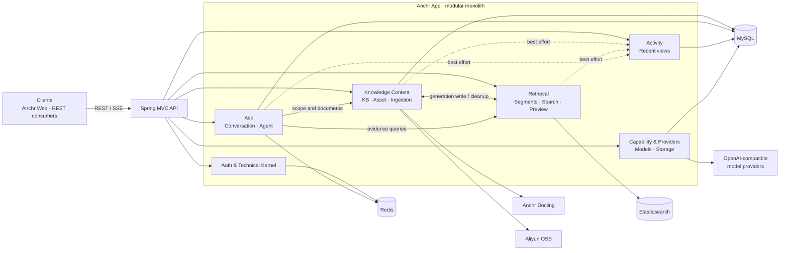

<div align="center">

# Anchr App

### Anchor your knowledge. Trust every answer.

**An evidence-first backend for document intelligence, hybrid retrieval, and agentic RAG.**

[](https://openjdk.org/)
[](https://spring.io/projects/spring-boot)
[](https://www.elastic.co/elasticsearch)
[](https://www.mysql.com/)
[](./LICENSE)

English · [简体中文](./README.zh-CN.md)

</div>

---

## About Anchr

Anchr App is the backend of the Anchr knowledge system. It turns documents into searchable, citable evidence and exposes the workflows needed to manage knowledge bases, ingest files, retrieve relevant passages, stream grounded answers, and inspect how Agent runs were produced.

The application is a Java 21 and Spring Boot modular monolith. MySQL owns business state, Elasticsearch stores versioned segment projections, Redis supports access tokens, ID allocation, query-rewrite caching, and recoverable Agent snapshots, while an authenticated [Anchr Docling](https://github.com/ryanmeowy/anchr-docling) sidecar handles document parsing.

> [!IMPORTANT]
> This repository contains the API service only. Use [Anchr Web](https://github.com/ryanmeowy/anchr-web) for the browser workspace. Document ingestion additionally requires Anchr Docling, object storage, and configured model providers.

> [!NOTE]
> The project is under active development. Interfaces, migrations, and operational defaults may evolve before a stable release.

## Features

| Area | What it provides |
| --- | --- |
| **Knowledge content** | Knowledge-base and document lifecycle, health and statistics, object-storage references, deduplication, versioned asset generations, and reliable cleanup. |
| **Document ingestion** | Asynchronous batch ingestion, idempotent client requests, parse/embed/index stages, progress tracking, retries, reparse/re-embed operations, and Docling integration. |
| **Hybrid retrieval** | Full-text and vector recall, Chinese IK analysis, Reciprocal Rank Fusion, bounded reranking, metadata and modality filters, and generation-aware visibility. |
| **Evidence-first answers** | Query rewriting, answer generation, source citations, result cards, follow-up questions, segment preview, and document-context restoration. |
| **Agentic RAG** | Budgeted tool execution, knowledge search, document discovery and reading, asynchronous summaries, trace persistence, runtime recovery, cancellation, and traditional RAG fallback. |
| **Streaming workflows** | Server-Sent Events for answers and long-running Agent tasks, with persisted terminal state for refresh-safe clients. |
| **Runtime configuration** | Encrypted Generation, Embedding, multimodal Embedding, Rerank, and Aliyun OSS configuration with connection testing and controlled activation. |
| **Access and operations** | Redis-backed `ADMIN`, `USER`, and `GUEST` tokens, index lifecycle controls, Actuator health/metrics, recent activity views, Flyway migrations, and transactional outbox processing. |

## Design principles

- **Evidence before eloquence** — knowledge answers are tied to registered segments and source previews.
- **Explicit state ownership** — MySQL stores business truth; Elasticsearch remains a replaceable retrieval projection.
- **Recoverable asynchronous work** — ingestion and Agent tasks persist progress, failure, retry, and cancellation state.
- **Safe index evolution** — asset generations and physical index versions are handled separately, with alias-based activation.
- **Provider independence** — narrow ports isolate OpenAI-compatible model endpoints, Docling, and object storage from domain workflows.
- **Bounded complexity** — domain boundaries live inside one deployable modular monolith instead of premature microservices.

## Tech stack

| Layer | Technology |
| --- | --- |
| Runtime | Java 21 · Spring Boot 3.5 |
| API | Spring MVC · Jakarta Validation · REST · SSE |
| Persistence | MySQL 8.4 · MyBatis · Flyway |
| Retrieval | Elasticsearch 8.18 · BM25/IK · HNSW dense vectors · RRF · Rerank |
| Runtime state | Redis 7.4 |
| AI integration | Spring AI · OpenAI-compatible Generation, Embedding, multimodal Embedding, and Rerank endpoints |
| Documents and storage | Anchr Docling · Aliyun OSS · STS |
| Testing | JUnit 5 · Mockito · Spring Test · Testcontainers |

## Architecture



Cross-domain calls use small application APIs and caller-side anti-corruption layers. The write path intentionally avoids pretending that MySQL, Elasticsearch, and object storage form one distributed transaction: coordinators own state transitions, and an outbox retries delayed cleanup.

For the full boundary decision, see [Domain boundaries and interactions](./docs/domain-boundaries-and-interactions.md).

## Quick start

### Prerequisites

- [JDK 21](https://openjdk.org/)
- [Apache Maven](https://maven.apache.org/) `3.6.3+`
- [Docker Engine](https://docs.docker.com/engine/install/) with Docker Compose
- An Elasticsearch IK plugin archive compatible with Elasticsearch `8.18.8`
- For the complete workflow:
  - a running [Anchr Docling](https://github.com/ryanmeowy/anchr-docling) service;
  - an Aliyun OSS bucket and credentials;
  - OpenAI-compatible Generation, Embedding or multimodal Embedding, and Rerank endpoints.

### 1. Clone the repository

```bash
git clone https://github.com/ryanmeowy/smart-vision.git anchr-app
cd anchr-app
```

### 2. Add the Elasticsearch IK plugin

Download the release archive compatible with Elasticsearch `8.18.8` from [analysis-ik releases](https://github.com/infinilabs/analysis-ik/releases), then place it in the repository root using the name expected by the Dockerfile:

```text
elasticsearch-analysis-ik-8.18.8.zip
```

The archive is intentionally not committed to this repository. `docker compose build` cannot build the Elasticsearch image until the file is present.

### 3. Configure the environment

```bash
cp .env.example .env
```

Replace every `change-me` value. Generate the encryption material with:

```bash
openssl rand -base64 32
openssl rand -base64 16
```

Use the first value as `APP_ENCRYPT_KEY` and the second as `APP_ENCRYPT_IV`. The Docling token must match `ANCHR_DOCLING_API_TOKEN` in the sidecar.

The template is organized into these groups:

| Group | Variables | Purpose |
| --- | --- | --- |
| Redis | `REDIS_HOST`, `REDIS_PORT`, `REDIS_PASSWORD` | Tokens, distributed ID segments, rewrite cache, and Agent snapshots. |
| Elasticsearch | `ES_USERNAME`, `ES_PASSWORD`, `ES_HOST` | Segment indexes, aliases, lexical recall, and vector recall. |
| MySQL | `MYSQL_HOST`, `MYSQL_PORT`, `MYSQL_DATABASE`, `MYSQL_USER`, `MYSQL_PASSWORD`, `MYSQL_ROOT_PASSWORD` | Application state and Docker Compose initialization. |
| Security | `APP_ADMIN_SECRET`, `APP_ENCRYPT_KEY`, `APP_ENCRYPT_IV` | Token administration and encryption of provider credentials. |
| Docling | `APP_DOCLING_BASE_URL`, `APP_DOCLING_API_TOKEN` | Authenticated asynchronous parsing. |
| Server | `SERVER_HOST`, `SERVER_PORT` | HTTP bind address and port. |

> [!WARNING]
> Do not commit `.env`. Keep the encryption key and IV stable for existing encrypted configuration records, and use a secret manager in production.

### 4. Start infrastructure

Docker Compose starts Elasticsearch, Redis, and MySQL on loopback-only ports:

```bash
docker compose up -d
docker compose ps
```

The application itself and Anchr Docling run separately.

### 5. Start Anchr App

Spring Boot does not load the repository `.env` file automatically. Export it into the current shell before starting the application:

```bash
set -a
source .env
set +a
mvn spring-boot:run
```

Flyway applies the database schema on startup. The API is available at [http://127.0.0.1:8080](http://127.0.0.1:8080) with the example defaults.

Check the application:

```bash
curl http://127.0.0.1:8080/actuator/health
```

### 6. Create an access token

Issue a one-hour administrator token using the configured admin secret:

```bash
curl --get http://127.0.0.1:8080/api/v1/auth/refresh-token \
  --header "X-Admin-Secret: ${APP_ADMIN_SECRET}" \
  --data-urlencode "role=ADMIN"
```

Send the returned token as `X-Access-Token` on protected requests. Supported roles are `ADMIN`, `USER`, and `GUEST`; write and administration endpoints require the roles declared by each controller.

### 7. Finish runtime setup

Use the **Settings** workspace in Anchr Web, or the `/api/v1/settings` endpoints, to:

1. configure and test Aliyun OSS;
2. configure Generation and Rerank providers;
3. configure either a text Embedding or multimodal Embedding provider;
4. activate the selected providers and wait for the Segment index to become ready.

The frontend defaults to `http://127.0.0.1:8080` for this API.

## API surface

All business responses use a common result envelope. Protected endpoints expect `X-Access-Token`.

| Prefix | Responsibility |
| --- | --- |
| `/api/v1/auth` | Token validation and administration; upload STS credentials. |
| `/api/v1/settings` | Model capability and object-storage configuration. |
| `/api/v1/kbs` | Knowledge bases, documents, health, previews, and statistics. |
| `/api/v1/kbs/{kbId}/ingestion-tasks` | Ingestion creation, progress, failed-item retry, reparse, and re-embed. |
| `/api/v1/search` | Filtered hybrid retrieval with optional generated answers. |
| `/api/v1/conversations` | Sessions, history, synchronous answers, and SSE answers. |
| `/api/v1/agent/runs` · `/api/v1/agent/tasks` | Agent traces, snapshots, recovery, task streaming, and cancellation. |
| `/api/v1/activity` | Recent questions, citations, searches, and documents. |
| `/api/v1/index` · `/api/v1/preview` | Segment index lifecycle and source-context preview. |
| `/actuator` · `/api/v1/health` | Runtime and Elasticsearch health. |

## Configuration

Most operational tuning has safe defaults in [`application.yaml`](./src/main/resources/application.yaml). Override these only when the workload requires it:

- `APP_AGENT_*` — Agent budgets, timeouts, tool-call mode, task leases, and runtime snapshot TTL;
- `APP_INGESTION_*` — polling, claim batch size, parse timeout, and retries;
- `APP_EMBEDDING_*` — ingestion rate-limit pacing and backoff;
- `APP_OUTBOX_*` — polling, leases, retries, retention, and cleanup schedule;
- `APP_CONVERSATION_*` — intent routing and legacy evidence fallback;
- `APP_DOCLING_*` — response limit and embedded-image upload behavior.

Model endpoints, API keys, model names, dimensions, and storage credentials are runtime records managed through Settings rather than static environment variables.

## Development

### Common commands

| Command | Description |
| --- | --- |
| `mvn spring-boot:run` | Start the API in development mode. |
| `mvn test` | Run unit, contract, and integration tests; Docker-backed tests require a working Docker daemon. |
| `mvn -DskipTests package` | Build the executable Spring Boot JAR. |
| `java -jar target/anchr-app-0.0.1-SNAPSHOT.jar` | Run the packaged application after exporting its environment. |
| `docker compose logs -f elasticsearch` | Follow Elasticsearch startup and plugin logs. |

### Project structure

See [`project_layout.text`](./project_layout.text) for the maintained repository and package map.

### Further reading

- [Agent RAG workflow](./docs/agent-rag-workflow.md)
- [Agentic RAG evolution plan](./docs/agentic-rag-evolution-plan.md)
- [Intent-routing report](./docs/agent-rag-intent-routing-report.md)
- [Domain boundaries and interactions](./docs/domain-boundaries-and-interactions.md)

## Production notes

- Terminate TLS at a trusted reverse proxy and disable response buffering for SSE routes.
- Keep MySQL, Elasticsearch, Redis, Docling, provider APIs, and object storage on private network paths.
- Store admin, encryption, Docling, model, and storage secrets outside source control.
- Persist and back up MySQL and object storage; manage Elasticsearch indexes as rebuildable projections.
- Monitor `/actuator/health`, `/actuator/metrics`, ingestion failures, Agent task leases, outbox retries, and index alias state.
- Validate migrations and index rebuilds against production-like data before deployment.

## Contributing

Bug reports, ideas, and focused Pull Requests are welcome.

1. Open an issue describing the behavior or proposal.
2. Create a focused branch from the intended base branch.
3. Preserve domain ownership and existing REST/SSE contracts unless the change explicitly revises them.
4. Add tests for behavior, failure paths, and persistence/query changes.
5. Run the relevant focused tests and `mvn test`, then report any Docker/Testcontainers skips separately.

Please do not include access tokens, provider keys, storage credentials, private documents, or production traces in public issues.

## License

Anchr App is released under the [MIT License](./LICENSE).

---

<div align="center">

Built with care for answers you can trace.

Copyright © 2026

</div>
