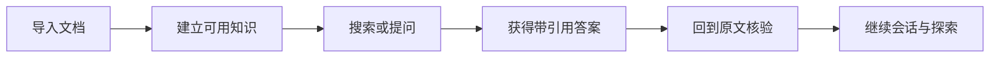

# Anchr

### 锚定知识，信任每一个答案。

**面向自有文档的证据优先知识工作台。** 
从内容导入、混合检索到 Agent 深度阅读，让答案有来源、过程有边界、结论可核验。

[在线体验](https://anchr.cloud) · [产品概览](README.md) · [技术文档](README-CN.md) · [English](README-EN.md) · [Web 工作台](https://github.com/ryanmeowy/anchr-web)

  
   
  Anchr 产品总览 · 点击查看大图

---

<b>📕 目录</b>

- [Anchr 是什么](#anchr-是什么)
- [快速开始](#快速开始)
- [核心体验](#核心体验)
- [主要能力](#主要能力)
- [典型场景](#典型场景)
- [适合谁](#适合谁)
- [为什么选择 Anchr](#为什么选择-anchr)
- [产品组成](#产品组成)
- [当前阶段](#当前阶段)
- [进一步了解](#进一步了解)

## Anchr 是什么

Anchr 是一套开源、可自主托管的文档知识工作台，面向需要使用自有资料进行搜索、问答、研究与知识复用的用户。

它把原始文档转化为可搜索、可引用、可预览的知识证据。用户既可以直接检索内容，也可以围绕一个知识库、几份指定文档或一个具体问题展开对话；当任务需要多步查找、连续阅读或跨文档归纳时，还可以让 Agent 在明确范围内继续探索。

Anchr 关注的不只是“生成一个答案”，而是让用户知道答案依据了什么、能否回到原文、复杂任务进行到了哪里。

> [!IMPORTANT]
> 本仓库提供 Anchr 的 API 服务。完整产品体验需要配合 [Anchr Web](https://github.com/ryanmeowy/anchr-web)；文档处理需要 [Anchr Docling](https://github.com/ryanmeowy/anchr-docling) 以及已配置的存储和模型能力。

## 快速开始

### 在线体验

访问 [anchr.cloud](https://anchr.cloud)，直接体验 Anchr 的浏览器工作台。

建议准备一组你熟悉、方便核验的文档，然后按以下路径体验：

1. 创建知识库并导入文档；
2. 等待文档进入可用状态，通过搜索确认关键内容能够被找到；
3. 在 Ask 中限定知识范围并提出问题；
4. 查看答案引用、结果卡片与原文预览；
5. 再尝试一个需要跨文档查找、阅读或归纳的问题。

使用熟悉的材料，可以直接判断三件事：**是否找对内容、是否引用相关证据、是否能顺畅回到原文。**

### 自主托管

如需在自己的环境中运行完整产品：

1. 按[中文技术文档](README-CN.md)启动 Anchr App，并准备 Anchr Web 与 Anchr Docling；
2. 在设置中完成存储、生成、向量化和排序能力配置；
3. 启动 Web 工作台，按上面的在线体验路径验证完整知识闭环。

## 核心体验

### 📚 把文档变成可持续使用的知识

按主题或业务范围组织知识库，批量导入文档，并查看处理进度、可用状态与失败信息。内容发生变化时，可以重新处理，而不是把知识库当成一次性数据集。

### 🔎 搜索不止于关键词

结合文本与语义相关性查找内容，并把搜索范围收敛到指定知识库或文档。用户可以浏览结果，也可以基于相关证据继续提问。

### 🌱 回答有据可查

知识型回答携带来源引用和结果卡片。用户可以进入相关文档片段及上下文预览，确认回答使用了哪些材料，而不是只接受一段无法核实的结论。

  
   
  引用与原文核验 · 点击查看大图

### 🧭 Agent 面向真实文档工作

面对需要多步探索的问题，Agent 可以在授权范围内查找文档、搜索知识、连续阅读并发起文档总结。任务设有执行边界，并提供活动状态、恢复与取消能力。

  
   
  Agent 文档任务 · 点击查看大图

### 🕘 让知识探索可以继续

会话、历史回答、最近问题、搜索、引用和文档活动可以被重新访问。用户能够从上一次发现继续，而不必反复重建上下文。

## 主要能力

| 能力 | 用户可以做什么 |
| --- | --- |
| **知识库与文档** | 创建知识空间、批量导入资料、查看健康度和处理状态、处理失败任务与内容更新。 |
| **混合检索** | 通过文字和语义相关性查找内容，按知识库、文档与内容类型收窄范围。 |
| **可信问答** | 基于检索证据生成回答，获得来源引用、结果卡片和后续问题建议。 |
| **原文核验** | 从搜索结果或回答引用进入文档片段及相邻上下文，恢复证据所在位置。 |
| **Agentic RAG** | 让 Agent 搜索、定位、阅读和总结文档，并查看运行活动与最终状态。 |
| **连续工作流** | 保存会话与回答，重新访问最近问题、搜索、引用和导入文档。 |
| **自主配置** | 在自己的环境中运行，并选择适合自身需求的生成、向量化、排序与存储服务。 |
| **服务集成** | 通过 API 把文档检索、可信问答和任务能力接入已有产品或内部工具。 |

## 典型场景

### 📑 制度与流程查询

从内部规范中找到适用条款，生成带引用的说明，并回到原文确认条件与上下文。

### 🧪 研究资料梳理

围绕一个主题跨多份材料查找线索、比较观点、归纳信息，同时保留关键结论的来源。

### 🗂️ 项目知识回顾

从方案、会议材料和交付文档中定位历史决策、约束与背景，减少依赖个人记忆。

### 💬 产品与支持知识库

快速查找功能说明、操作步骤和已知处理方式，为重复出现的问题提供可复核的回答。

### 📖 长文档理解

针对指定文档提问，连续阅读相关部分，或发起独立的文档总结任务。

### 🔌 知识能力集成

为已有门户、工作台或内部工具补充文档检索、证据问答与 Agent 文档任务。

## 适合谁

- **知识工作者与研究人员**：需要从大量资料中快速找到信息，并为结论保留出处；
- **产品、运营与支持人员**：需要持续使用制度、手册、方案和产品文档；
- **管理内部知识的团队**：重视知识更新状态、回答可信度和原文复核路径；
- **希望自主托管的团队**：希望掌握自己的文档、模型配置与存储选择；
- **知识应用开发者**：希望在现有界面或业务流程中接入完整的文档智能能力。

> [!NOTE]
> 如果需求只是无来源约束的开放式聊天，Anchr 并不是为此设计。它更适合答案需要受到文档范围约束、并且需要被复核的场景。

## 为什么选择 Anchr

### 证据闭环，而不是答案终点

回答、引用、结果卡片与原文预览连接在一起，“得到答案”之后仍然可以继续核验。

### 搜索、问答与阅读是一条路径

用户无需在独立工具之间反复切换，可以从内容发现自然进入理解、追问和原文阅读。

### 知识范围是产品交互的一部分

问题可以限定在选定知识库或文档中，复杂任务也只能在授权范围内探索。

### 长任务有边界、有状态

Agent 和文档任务不是不可见的后台黑盒。用户可以了解活动状态，并在需要时恢复或取消。

### 文档变化属于主流程

导入进度、失败处理、重新解析与知识更新都是产品能力，而不是部署完成后的人工补丁。

### 保留部署与供应商选择权

Anchr 可以运行在自己的环境中，并配置适合自身需求的模型与存储服务。

## 产品组成

| 组件 | 产品职责 |
| --- | --- |
| [**Anchr Web**](https://github.com/ryanmeowy/anchr-web) | 面向用户的浏览器工作台，承载知识库、搜索、Ask、预览、活动和设置体验。 |
| **Anchr App** | 本仓库；提供知识管理、检索、问答、Agent、活动与配置等产品工作流。 |
| [**Anchr Docling**](https://github.com/ryanmeowy/anchr-docling) | 将原始文档解析为后续检索与阅读可以使用的内容。 |

## 当前阶段

Anchr 仍在积极开发中，产品界面、接口与默认行为可能继续演进。当前重点是建立可靠的文档知识闭环：

- 让内容可以被持续导入和更新；
- 让搜索与提问受到明确知识范围约束；
- 让答案可以通过引用与原文预览被核验；
- 让复杂文档任务具备清晰的执行边界和状态。

在线演示可通过 [anchr.cloud](https://anchr.cloud) 访问。自主托管前请先阅读技术文档中的依赖条件与运行说明。

## 进一步了解

- [中文技术文档](README-CN.md)：安装、配置、接口、开发和生产注意事项；
- [English README](README-EN.md)：英文技术说明；
- [Agent RAG 当前实现](./docs/agent-rag-workflow.md)：Agent、证据、降级与恢复行为；
- [领域边界与交互](./docs/domain-boundaries-and-interactions.md)：系统职责与状态边界；
- [Docker 部署](./docker/README.md)：容器化运行说明。

---

**让每一个知识答案，都有可以回到原文的锚点。**

