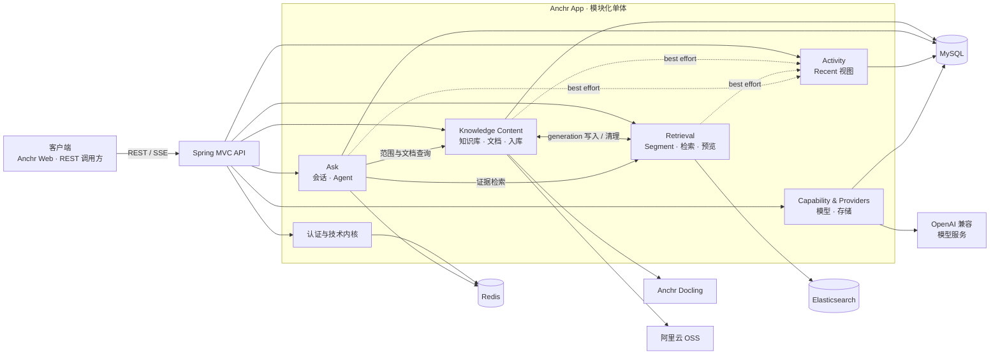

<div align="center">

# Anchr App

### 锚定知识，信任每一个答案。

**面向文档智能、混合检索与 Agentic RAG 的证据优先后端。**

[](https://openjdk.org/)
[](https://spring.io/projects/spring-boot)
[](https://www.elastic.co/elasticsearch)
[](https://www.mysql.com/)
[](./LICENSE)

[English](./README.md) · 简体中文

</div>

---

## 关于 Anchr

Anchr App 是 Anchr 知识系统的后端。它把文档转化为可检索、可引用的证据，并提供知识库管理、文档入库、相关片段召回、可信答案流式生成以及 Agent 执行过程追踪所需的完整工作流。

应用基于 Java 21 和 Spring Boot，以模块化单体方式组织。MySQL 保存业务事实，Elasticsearch 保存带版本的 Segment 检索投影，Redis 支撑访问令牌、ID 分段、查询改写缓存和可恢复的 Agent 快照；经过鉴权的 [Anchr Docling](https://github.com/ryanmeowy/anchr-docling) sidecar 负责文档解析。

> [!IMPORTANT]
> 本仓库只包含 API 服务。浏览器工作台请使用 [Anchr Web](https://github.com/ryanmeowy/anchr-web)。完整的文档入库流程还需要 Anchr Docling、对象存储和已配置的模型服务。

> [!NOTE]
> 项目仍在积极开发中。在稳定版本发布前，接口、数据库迁移和运维默认值可能继续演进。

## 核心能力

| 领域 | 能力 |
| --- | --- |
| **知识内容** | 知识库与文档生命周期、健康度与统计、对象存储引用、去重、Asset generation 版本管理和可靠清理。 |
| **文档入库** | 异步批量任务、客户端请求幂等、解析/向量化/索引阶段、进度追踪、失败重试、重新解析、重新向量化和 Docling 集成。 |
| **混合检索** | 全文与向量双路召回、中文 IK 分词、RRF 融合、受控 Rerank、元数据/模态过滤和 generation 可见性校验。 |
| **证据优先回答** | 查询改写、答案生成、来源引用、结果卡片、追问建议、Segment 预览和原文上下文恢复。 |
| **Agentic RAG** | 带预算的工具执行、知识搜索、文档定位与顺序阅读、异步总结、Trace 持久化、运行恢复、取消和传统 RAG 降级。 |
| **流式工作流** | 通过 SSE 输出答案和长耗时 Agent 任务，并持久化终态以支持客户端刷新恢复。 |
| **运行时配置** | 加密保存 Generation、Embedding、多模态 Embedding、Rerank 与阿里云 OSS 配置，支持连通性测试和受控激活。 |
| **访问与运维** | Redis 支撑的 `ADMIN`、`USER`、`GUEST` 令牌、索引生命周期、Actuator 健康与指标、Recent 活动视图、Flyway 迁移和事务 Outbox。 |

## 设计原则

- **证据先于表达**：知识型答案必须关联已注册的 Segment 和可恢复的原文预览。
- **状态所有权清晰**：MySQL 保存业务事实，Elasticsearch 是可以重建的检索投影。
- **异步任务可恢复**：入库和 Agent 任务都显式保存进度、失败、重试与取消状态。
- **索引演进安全**：Asset generation 与物理索引版本分开管理，并通过 alias 完成激活。
- **隔离外部提供方**：通过窄 Port 隔离 OpenAI 兼容模型、Docling 和对象存储。
- **控制系统复杂度**：在一个可部署的模块化单体内维护领域边界，不做过早的微服务拆分。

## 技术栈

| 层次 | 技术 |
| --- | --- |
| 运行时 | Java 21 · Spring Boot 3.5 |
| API | Spring MVC · Jakarta Validation · REST · SSE |
| 持久化 | MySQL 8.4 · MyBatis · Flyway |
| 检索 | Elasticsearch 8.18 · BM25/IK · HNSW 稠密向量 · RRF · Rerank |
| 运行时状态 | Redis 7.4 |
| AI 集成 | Spring AI · OpenAI 兼容的 Generation、Embedding、多模态 Embedding 与 Rerank 接口 |
| 文档与存储 | Anchr Docling · 阿里云 OSS · STS |
| 测试 | JUnit 5 · Mockito · Spring Test · Testcontainers |

## 系统架构



跨领域调用通过小型 Application API 和调用方 ACL 完成。写入链路不会把 MySQL、Elasticsearch 和对象存储伪装成一个分布式事务：Process Coordinator 负责状态迁移，Outbox 负责重试延迟清理。

完整边界决策见[领域边界与交互](./docs/domain-boundaries-and-interactions.md)。

## 快速开始

### 前置要求

- [JDK 21](https://openjdk.org/)
- [Apache Maven](https://maven.apache.org/) `3.6.3+`
- [Docker Engine](https://docs.docker.com/engine/install/) 与 Docker Compose
- 与 Elasticsearch `8.18.8` 匹配的 IK 分词插件压缩包
- 如需运行完整流程，还需要：
  - 正在运行的 [Anchr Docling](https://github.com/ryanmeowy/anchr-docling)；
  - 一个阿里云 OSS Bucket 及其凭据；
  - OpenAI 兼容的 Generation、Embedding 或多模态 Embedding、Rerank 服务。

### 1. 克隆仓库

```bash
git clone https://github.com/ryanmeowy/smart-vision.git anchr-app
cd anchr-app
```

### 2. 准备 Elasticsearch IK 插件

从 [analysis-ik releases](https://github.com/infinilabs/analysis-ik/releases) 下载与 Elasticsearch `8.18.8` 兼容的压缩包，并按 Dockerfile 期望的名称放到仓库根目录：

```text
elasticsearch-analysis-ik-8.18.8.zip
```

该二进制文件没有提交到仓库。在文件就位前，`docker compose build` 无法构建 Elasticsearch 镜像。

### 3. 配置环境变量

```bash
cp .env.example .env
```

替换所有 `change-me` 值。使用以下命令生成加密材料：

```bash
openssl rand -base64 32
openssl rand -base64 16
```

第一个值填写到 `APP_ENCRYPT_KEY`，第二个值填写到 `APP_ENCRYPT_IV`。Docling Token 必须与 sidecar 中的 `ANCHR_DOCLING_API_TOKEN` 保持一致。

模板按以下分组组织：

| 分组 | 环境变量 | 用途 |
| --- | --- | --- |
| Redis | `REDIS_HOST`、`REDIS_PORT`、`REDIS_PASSWORD` | Token、分布式 ID 分段、查询改写缓存和 Agent 快照。 |
| Elasticsearch | `ES_USERNAME`、`ES_PASSWORD`、`ES_HOST` | Segment 索引、alias、全文召回和向量召回。 |
| MySQL | `MYSQL_HOST`、`MYSQL_PORT`、`MYSQL_DATABASE`、`MYSQL_USER`、`MYSQL_PASSWORD`、`MYSQL_ROOT_PASSWORD` | 应用状态和 Docker Compose 初始化。 |
| 安全 | `APP_ADMIN_SECRET`、`APP_ENCRYPT_KEY`、`APP_ENCRYPT_IV` | Token 管理和模型/存储凭据加密。 |
| Docling | `APP_DOCLING_BASE_URL`、`APP_DOCLING_API_TOKEN` | 带鉴权的异步文档解析。 |
| Server | `SERVER_HOST`、`SERVER_PORT` | HTTP 监听地址与端口。 |

> [!WARNING]
> 不要提交 `.env`。已有加密配置存在时，应保持加密 Key 和 IV 稳定；生产环境请使用 Secret Manager。

### 4. 启动基础设施

Docker Compose 会在仅绑定本机回环地址的端口上启动 Elasticsearch、Redis 和 MySQL：

```bash
docker compose up -d
docker compose ps
```

Java 应用和 Anchr Docling 需要分别启动。

### 5. 启动 Anchr App

Spring Boot 不会自动读取仓库根目录的 `.env`。启动前需要把它导入当前 Shell：

```bash
set -a
source .env
set +a
mvn spring-boot:run
```

Flyway 会在启动时自动创建或迁移数据库。使用示例默认值时，API 地址为 [http://127.0.0.1:8080](http://127.0.0.1:8080)。

检查应用健康状态：

```bash
curl http://127.0.0.1:8080/actuator/health
```

### 6. 创建访问令牌

使用配置的 Admin Secret 签发一个有效期一小时的管理员 Token：

```bash
curl --get http://127.0.0.1:8080/api/v1/auth/refresh-token \
  --header "X-Admin-Secret: ${APP_ADMIN_SECRET}" \
  --data-urlencode "role=ADMIN"
```

调用受保护接口时，通过 `X-Access-Token` Header 传入返回值。系统支持 `ADMIN`、`USER` 和 `GUEST` 三种角色；写入和管理接口以各 Controller 声明的角色为准。

### 7. 完成运行时配置

通过 Anchr Web 的 **Settings** 页面，或 `/api/v1/settings` 接口：

1. 配置并测试阿里云 OSS；
2. 配置 Generation 与 Rerank 服务；
3. 配置文本 Embedding 或多模态 Embedding 服务；
4. 激活选中的配置，并等待 Segment 索引进入 Ready 状态。

Anchr Web 默认连接当前 API 的 `http://127.0.0.1:8080`。

## API 概览

所有业务响应使用统一 Result Envelope。受保护接口需要 `X-Access-Token`。

| 路径前缀 | 职责 |
| --- | --- |
| `/api/v1/auth` | Token 校验与管理、上传 STS 临时凭据。 |
| `/api/v1/settings` | 模型能力与对象存储配置。 |
| `/api/v1/kbs` | 知识库、文档、健康度、预览与统计。 |
| `/api/v1/kbs/{kbId}/ingestion-tasks` | 创建入库任务、查询进度、失败 Item 重试、重新解析与重新向量化。 |
| `/api/v1/search` | 带过滤条件的混合检索与可选生成式回答。 |
| `/api/v1/conversations` | 会话、历史消息、同步回答与 SSE 回答。 |
| `/api/v1/agent/runs` · `/api/v1/agent/tasks` | Agent Trace、快照、恢复、任务流式输出与取消。 |
| `/api/v1/activity` | 最近问题、引用、搜索和文档。 |
| `/api/v1/index` · `/api/v1/preview` | Segment 索引生命周期与原文上下文预览。 |
| `/actuator` · `/api/v1/health` | 应用运行状态和 Elasticsearch 健康度。 |

## 配置说明

大部分运维参数在 [`application.yaml`](./src/main/resources/application.yaml) 中已有安全默认值，仅在工作负载确实需要时覆盖：

- `APP_AGENT_*`：Agent 预算、超时、工具调用模式、任务 Lease 和运行时快照 TTL；
- `APP_INGESTION_*`：轮询、Claim 批量、解析超时和重试；
- `APP_EMBEDDING_*`：入库向量化的限速节奏和退避；
- `APP_OUTBOX_*`：轮询、Lease、重试、保留期和清理计划；
- `APP_CONVERSATION_*`：Intent Routing 与旧证据降级；
- `APP_DOCLING_*`：响应体限制和内嵌图片上传开关。

模型地址、API Key、模型名、向量维度和存储凭据都通过 Settings 管理为运行时记录，而不是写死在环境变量中。

## 开发

### 常用命令

| 命令 | 说明 |
| --- | --- |
| `mvn spring-boot:run` | 以开发模式启动 API。 |
| `mvn test` | 运行单元、契约和集成测试；依赖 Docker 的测试需要可用的 Docker Daemon。 |
| `mvn -DskipTests package` | 构建可执行 Spring Boot JAR。 |
| `java -jar target/anchr-app-0.0.1-SNAPSHOT.jar` | 导出环境变量后运行构建产物。 |
| `docker compose logs -f elasticsearch` | 查看 Elasticsearch 启动与插件日志。 |

### 项目结构

持续维护的仓库与 Package 地图见 [`project_layout.text`](./project_layout.text)。

### 延伸阅读

- [Agent RAG 完整工作流](./docs/agent-rag-workflow.md)
- [领域边界与交互](./docs/domain-boundaries-and-interactions.md)

## 生产部署提示

- 在可信反向代理终止 TLS，并为 SSE 路径关闭响应缓冲。
- 让 MySQL、Elasticsearch、Redis、Docling、模型服务和对象存储走私有网络。
- 在源码之外保存 Admin、加密、Docling、模型与存储密钥。
- 持久化并备份 MySQL 与对象存储；将 Elasticsearch 索引作为可重建投影管理。
- 监控 `/actuator/health`、`/actuator/metrics`、入库失败、Agent Task Lease、Outbox 重试和索引 alias 状态。
- 上线前使用接近生产的数据验证数据库迁移与索引重建。

## 参与贡献

欢迎提交 Bug、想法和范围清晰的 Pull Request。

1. 先创建 Issue，描述行为或提案。
2. 从目标基线创建聚焦的分支。
3. 除非变更明确要求，否则保持领域状态所有权和现有 REST/SSE 契约。
4. 为行为、失败路径以及持久化/查询变化补充测试。
5. 运行相关测试和 `mvn test`，并单独说明 Docker/Testcontainers 跳过项。

请勿在公开 Issue 中附带访问令牌、模型 Key、存储凭据、私有文档或生产 Trace。

## 开源许可

Anchr App 基于 [MIT License](./LICENSE) 开源。

---

<div align="center">

用心构建每一个可追溯的答案。

Copyright © 2026

</div>
