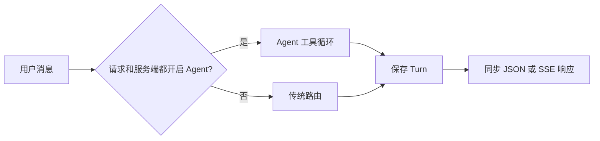
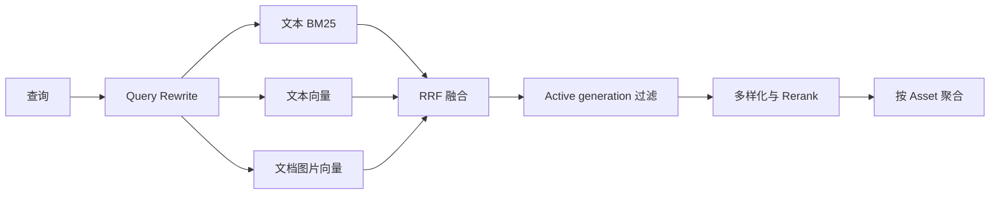

# Agent RAG 实现说明

本文记录 `anchr-app` 当前的 Agent RAG 执行路径、状态、限制和失败语义。内容以源码、运行配置和数据库迁移为准，不包含规划中的能力。

## 1. 执行路径

消息请求在 Agent 和传统流程中择一执行：



关键约束：

- 模型决定工具调用；权限、预算、证据、引用和终态由后端校验。
- 传统流程先路由 `CHAT`、`OTHER` 和 `KB_QUERY`，仅 `KB_QUERY` 执行 RAG。
- Agent 只能引用当前 Run 注册的 Segment。
- Elasticsearch 可同时保留多个 generation，查询只接受资产的 active generation。
- SSE 断开不取消执行；Turn 仍会落库，客户端通过 Run、Task 或消息接口恢复状态。
- 文档总结使用异步 Task，不在同步 Run 中读取全文。

## 2. API 与请求范围

### 2.1 API

| 场景 | API | 行为 |
| --- | --- | --- |
| 同步问答 | `POST /api/v1/conversations/{sessionId}/messages` | 执行完成并保存 Turn 后返回 JSON |
| 消息 SSE | `POST /api/v1/conversations/{sessionId}/messages/stream` | 实时发送过程事件和安全的模型答案增量，终态使用完整答案校准 |
| 查询 Run | `GET /api/v1/agent/runs/{runId}/activity` | 返回持久化的 Run、Step、工具、Token 和耗时 |
| 查询可恢复 Run | `GET /api/v1/agent/runs/recoverable?limit=10` | 返回不超过 `limit` 条记录；默认 10 条、最大 20 条，优先活动 Run，并包含最近 10 分钟内启动的 Run |
| 查询运行快照 | `GET /api/v1/agent/runs/{runId}/runtime-snapshot?afterVersion=0` | 仅在快照版本较新时返回 Redis 中的最新运行态 |
| 取消 Run | `POST /api/v1/agent/runs/{runId}/cancel` | 请求取消仍处于 `RUNNING` 的同步 Agent Run |
| 查询异步任务 | `GET /api/v1/agent/tasks/{taskId}` | 返回任务状态、进度、答案和引用 |
| 订阅异步任务 | `GET /api/v1/agent/tasks/{taskId}/stream` | SSE 发送任务进度及终态答案 |
| 取消异步任务 | `POST /api/v1/agent/tasks/{taskId}/cancel` | 取消 `PENDING/RUNNING` 任务并更新 Turn 与 Run |

消息字段：

| 字段 | 作用 |
| --- | --- |
| `query` | 用户问题，最多 1000 字符 |
| `kbIds` | 本次知识库范围 |
| `assetIdList` | 本次显式文档范围；非空时文档工具不得越界 |
| `limit` | 检索结果数量，范围 1–200 |
| `answerMode` | `STRICT`、`SUMMARY` 或 `EXPLORE` |
| `preferredModalities` | `TEXT`、`IMAGE` 或 `MIXED` |
| `agentEnabled` | 客户端是否请求使用 Agent |

### 2.2 组件职责

- `ConversationServiceImpl` 是稳定的应用服务门面。
- `ConversationMessageUseCase` 负责加载会话、归一化请求范围、生成 `turnId/runId`、调用编排器、在事务中保存 Turn/Task、提交后触发异步任务，以及在 Turn 保存后 Finalize Run。
- `ConversationMessageOrchestrator` 只负责选择 Agent 路径或传统路径。
- `ConversationMessageStreamAdapter` 把同一个消息用例适配为 SSE，不负责业务编排。

### 2.3 范围处理

处理顺序：

1. 加载未软删除的会话；不存在则返回 `CONVERSATION_SESSION_NOT_FOUND`。
2. 请求没有 `kbIds` 且会话已有 `kbScope` 时，继承会话范围。
3. 其他情况下，通过 `ConversationKnowledgeAcl` 把 `kbIds` 收敛为当前可见的活动知识库。
4. `answerMode` 默认 `STRICT`。
5. `preferredModalities` 为空时默认 `MIXED`。
6. `assetIdList` 是本次消息的显式文档范围，并原样记录到 Turn；Agent 还会在服务端把这些 ID 解析为当前有效、可访问的资产。

#### 已知缺口：Session Asset Scope

数据库、领域对象和会话 DTO 已包含 `asset_scope/assetIdList`，但业务流程尚未接通：

- `ConversationSessionUseCase.create` 只保存 `kbScope`，没有把创建请求的 `assetIdList` 写入会话。
- `ConversationMessageUseCase.applyConversationScope` 只继承会话 `kbScope`，不会继承会话 `assetScope`。
- 当前生效范围以消息请求的 `assetIdList` 为准；会话级 Asset Scope 尚不可用。

## 3. Agent 与传统路径

只有以下两个条件同时满足才进入 Agent：

```text
request.agentEnabled == true
运行配置 AGENT.enabled == true
```

`AgentWorkflow` 是编排器的必需依赖。Bean 缺失属于装配错误，不会在运行时静默切换到传统流程。

非 Agent 路径先执行 Intent Router：

- `CHAT`：普通聊天生成，不执行知识检索。
- `OTHER`：返回能力范围澄清。
- `KB_QUERY`：进入传统 RAG Pipeline。

Agent 路径不执行 Intent Router。Agent 出现未预期异常且
`AGENT.fallbackToTraditional=true` 时，编排器重新路由并执行传统流程，执行模式记为 `AGENT_FALLBACK`。

## 4. Run 上下文与预算

### 4.1 Run state

`AgentRunState` 按 Run 隔离，包含：

- `runId`、`turnId`、`sessionId`、`userId` 和本次 KB/Asset 范围。
- 模型消息列表。
- 当前 Run 的 Evidence Registry，以 `segmentId` 去重。
- 已执行 Tool Call Key，用于拒绝重复调用。
- 各工具执行次数。
- 模型步骤数、工具调用数和 Prompt/Completion Token。
- 连续协议错误数、最终答案校验错误数、Trace 顺序和当前步骤。

`AgentRequestContextResolver` 会再次从服务端读取有效资源信息，并把上下文锁定为不可扩大的范围；上下文最多展示 50 个 KB 元数据和 20 个 Asset 元数据。

### 4.2 模型上下文

模型上下文包含：

1. 系统提示和回答模式约束。
2. 最近最多 10 个 Turn。
3. 每个历史问题和回答最多 1200 字符。
4. 历史总字符数最多 12000。
5. 删除历史回答中的旧 `[1]`、`[1-1]` 引用，避免把旧 Run 的编号当成当前证据。
6. 当前服务端资源上下文和用户问题。

### 4.3 默认预算

| 预算 | 默认值 |
| --- | ---: |
| 最大模型步骤 | 12 |
| 最大工具调用 | 8 |
| Run 总时限 | 90 秒 |
| 单次模型时限 | 30 秒，并受 Run 剩余时间约束 |

预算耗尽后的处理：

- 已有证据且至少还剩 500ms：进入 Evidence Finalizer。
- 没有证据或已无时间：返回本地澄清，`AnswerStatus=NO_EVIDENCE`，Run 最终为 `DEGRADED`，原因为 `agent_budget_exhausted`。

## 5. 模型协议

### 5.1 工具调用模式

| 模式 | 行为 |
| --- | --- |
| `NATIVE` | 只接受 OpenAI 兼容的原生 `tools/tool_calls` |
| `JSON` | 不发送原生工具定义，要求模型输出严格动作 JSON |
| `AUTO` | 优先原生工具；原生请求异常且仍有时间时回退 JSON 模式 |

原生模式默认设置：

- `tool_choice=required`，可配置为 `auto`。
- `parallelToolCalls=false`。
- 禁止 Spring AI 自动执行工具，由业务状态机统一执行。
- 温度 `0.2`，最大输出 Token `1500`。

JSON 模式只接受以下两种结构：

```json
{"action":"call_tools","toolCalls":[{"id":"call_1","name":"工具名","arguments":{}}]}
```

```json
{"action":"final","answerType":"CHAT|CLARIFICATION|KNOWLEDGE|NO_EVIDENCE","answer":"最终回答","citedSegmentIds":[]}
```

正常回答通过 `deliver_answer` 结束；严格 JSON `final` 用于不支持原生工具调用的模型。

### 5.2 协议错误

普通 Markdown 或自然语言不属于合法动作。处理规则：

| 连续错误 | Run 内证据 | 处理 |
| --- | --- | --- |
| 第一次 | 任意 | 注入修复提示并重试 |
| 第二次 | 有 | 进入 Evidence Finalizer |
| 第二次 | 无 | 返回本地安全回答 |

合法 Tool Call 会清零连续协议错误。第二次错误且无法用证据收尾时，返回
`AnswerStatus=MODEL_FALLBACK`；Turn 保存后 Run 为 `DEGRADED`，原因以
`agent_protocol_error:` 开头。

## 6. Agent 工具

| 工具 | 用途 | 关键输入 | 行为 | 注册证据 |
| --- | --- | --- | --- | --- |
| `find_documents` | 不确定目标文档 | `query`、`limit<=10` | 返回文档、真实 `assetId` 和匹配片段 | 是 |
| `search_knowledge` | 查询事实、规则、流程或相关内容 | `query`、可选 `assetIds`、`limit<=10`、模态 | Query Rewrite 后检索 | 是 |
| `read_document` | 连续阅读一份已定位文档 | `assetId`、`cursor`、`limit<=20` | 按原始顺序分页读取 | 是 |
| `summarize_documents` | 总结、分析或比较 1–3 份文档 | `assetIds`、`instruction`、`language` | 创建 `DOCUMENT_SUMMARY` 异步任务 | 否，任务自行读取全文证据 |
| `deliver_answer` | 提交最终回答 | 四种 `answerType`、正文、引用 ID | 进入最终答案校验 | 否 |

### 6.1 参数、权限与重复调用

`AgentToolExecutor` 统一处理：

1. 工具注册检查，否则 `UNKNOWN_TOOL`。
2. JSON 参数反序列化和 Jakarta Validation，否则 `INVALID_ARGUMENTS`。
3. 业务异常映射为稳定错误码。
4. 安全异常映射为 `PERMISSION_DENIED`。
5. 未知异常映射为 `TOOL_EXECUTION_FAILED`。

工具错误会作为 Tool Message 返回模型，不会自动结束 Run。

`AgentScopeGuard` 对文档类工具执行服务端范围校验：

1. 优先把输入当作 `assetId`，并在授权 KB 内查找。
2. 不是 ID 时，再按完整文件名或标题精确匹配。
3. 同名多文档返回 `AMBIGUOUS_DOCUMENT`。
4. 未找到返回 `DOCUMENT_NOT_FOUND`。
5. 本次请求有 `assetIdList` 时，越界访问返回 `PERMISSION_DENIED`。

`find_documents.documents[].assetId` 是后续文档工具的输入；`matchedSegmentId` 不是 `assetId`。

Tool Call 去重规则：

- 有 `call.id` 时直接使用 ID。
- 无 ID 时使用 `toolName + arguments`。
- 重复调用返回 `DUPLICATE_TOOL_CALL`，不再次执行。

### 6.2 `read_document` 限制

- 默认和最大页大小均为 20；过小值会提升到 10。
- 单次返回正文总量最多约 20000 字符。
- `nextCursor` 使用 Base64 URL-safe 编码。
- 同一 Run 已有证据后，最多真正执行两次 `read_document`；第三次会返回 `READ_LIMIT_REACHED`，随后直接进入 Evidence Finalizer。
- 需要完整通读时应改用 `summarize_documents`。

## 7. RAG 检索子流程

`search_knowledge` 先做对话感知 Query Rewrite；`find_documents` 结合资产元数据和检索结果定位文档。两者最终通过 `ConversationRetrievalAcl` 进入 Search 上下文。



### 7.1 Query Rewrite

- 使用最近最多 5 个 Turn。
- 历史上下文最多 6000 字符，每个字段最多 1200 字符。
- 当前问题最多 2000 字符。
- 模型必须输出严格 JSON。
- 超时、异常或格式错误时使用原始问题。

### 7.2 三路召回、generation gate 与 Rerank

`RetrievalQueryServiceImpl` 的执行顺序：

1. 通过 `SearchKnowledgeAcl` 解析当前可见 KB，并应用 KB/Asset/类型过滤。
2. 为查询生成一次 Embedding。
3. 并列执行全文/关键词召回、文本向量召回、文档图片向量召回。
4. 以 `segmentId` 做 RRF 融合。
5. 查询每个资产当前激活的 `indexGeneration`，丢弃 generation 不匹配的候选。
6. 做候选多样化。
7. 对有竞争力的窗口执行 Rerank。
8. 按 Asset 聚合 Top Chunks。

RRF：

```text
RRF(segment) = Σ 1 / (rankConstant + rankIndex + 1)
```

Rerank 默认值：

- 窗口 40，最小 20，最大 80。
- 标准化检索分数权重 `0.6`，Rerank 分数权重 `0.4`。
- Rerank 异常或空结果时保留 RRF 顺序。

新 generation 激活前，查询读取旧 generation。激活后，即使 Elasticsearch 暂时保留新旧 Segment，也只有新 generation 能通过过滤。

## 8. 证据收尾

Evidence Finalizer 使用当前 Run 已注册的证据生成受限答案，不再开放工具调用。

触发条件：

- Agent 预算耗尽且已有证据。
- 连续第二次协议错误且已有证据。
- 已有证据后试图第三次执行 `read_document`。

处理方式：

1. 从当前 Run Evidence Registry 选择最多 12 条证据。
2. 证据输入最多约 24000 字符。
3. 通过 `ConversationGenerationPort` 生成严格的 `KNOWLEDGE|NO_EVIDENCE` JSON。
4. 在剩余时间允许时最多尝试 2 次，每次仍受 Agent 单次模型时限约束。
5. 成功后继续走与 `deliver_answer` 相同的引用校验。

Finalizer 不可用或两次调用均失败时：

- 返回 `AnswerStatus=MODEL_FALLBACK`。
- 原因分别为 `agent_evidence_finalization_unavailable` 或 `agent_evidence_finalization_failed`。
- Turn 保存后 Run 终态为 `DEGRADED`。

## 9. 回答与引用

### 9.1 Answer Type

| `answerType` | 规则 |
| --- | --- |
| `CHAT` | 无需证据；禁止引用 ID 和 Segment Marker |
| `CLARIFICATION` | 无需证据；禁止引用 |
| `KNOWLEDGE` | 必须有当前 Run 证据、合法引用 ID 和正文 Marker |
| `NO_EVIDENCE` | 禁止引用；后端按回答模式替换为统一的安全无证据文案 |

`NO_EVIDENCE` 属于业务结果：`AnswerStatus=NO_EVIDENCE`，Turn 保存后 Run 为 `COMPLETED`。

### 9.2 Evidence Registry 与 KNOWLEDGE 校验

Run 内证据按以下结构注册：

```text
segmentId -> ConversationRetrievalCandidate
```

只有本轮 `find_documents`、`search_knowledge`、`read_document` 返回并注册的 Segment 才能引用。历史回答引用、模型编造的 ID 和其他 Run 的证据都无效。

KNOWLEDGE 依次校验当前 Run 是否有证据、引用 ID 是否属于本轮、正文是否包含合法 Marker。任一条件不满足都进入答案修复。

内部 Marker：

```text
结论内容 {{segment:真实SegmentID}}
```

渲染步骤：

1. 删除模型自行写入的 `[数字]` 引用。
2. 只识别当前 Evidence Registry 中的 Marker。
3. 按正文首次出现顺序分配文档和 Segment 索引。
4. 渲染成 `[1-1]`、`[1-2]`、`[2-1]`。
5. 生成包含 `kbId`、`assetId`、`segmentId`、页码、锚点和命中原因的 Citation。

首次校验失败时，错误返回模型修复；再次失败则返回安全的 `NO_EVIDENCE`。后端已生成合法终态答案，因此 Turn 保存后 Run 为 `COMPLETED`。

## 10. 异步文档总结

`summarize_documents` 返回 `AgentDeferredTask`。同步请求先保存 PROCESSING 占位 Turn 和 PENDING Task，事务提交后再触发后台处理。

Task status 与处理阶段是两组独立状态。

Task status：

```text
PENDING -> RUNNING -> SUCCEEDED | FAILED | CANCELLED
              |
              +-> PENDING（等待重试）
```

`currentStage`：

```text
QUEUED -> READING -> MAP_SUMMARY -> REDUCE_SUMMARY -> FINALIZING -> COMPLETED
任一执行阶段 -> RETRY_WAIT -> READING（重新执行）
任一活动阶段 -> FAILED | CANCELLED
```

发生可重试失败时，Task status 回到 `PENDING`，`currentStage` 设为 `RETRY_WAIT`；重新 Claim 后，Task status 再次变为 `RUNNING`。成功完成时，Task status 为 `SUCCEEDED`，`currentStage` 为 `COMPLETED`。

### 10.1 默认限制

| 限制 | 默认值 |
| --- | ---: |
| 文档数 | 1–3 |
| 最大 Segment 数 | 500 |
| 最大正文字符 | 500000 |
| Map/Reduce 批次字符 | 12000 |
| 任务总时限 | 10 分钟 |
| 单次总结模型时限 | 90 秒 |
| Lease | 2 分钟 |
| 最大重试 | 2 |
| 轮询间隔 | 5 秒 |

### 10.2 处理阶段

1. `READING`：按文档原始 Segment 顺序读取全文。
2. `MAP_SUMMARY`：按约 12000 字符分批生成局部总结，并保留 Marker。
3. `REDUCE_SUMMARY`：分层合并，直到形成单一草稿。
4. `FINALIZING`：执行一次最终模型压缩，并将安全的可见正文增量发送到任务 SSE。
5. 后端再用确定性 `compactCitationMarkers` 收敛引用：最多 10 个不同引用、12 个 Marker、每段最多 3 个 Marker。

任务用 Lease 和 Owner 保证单任务单执行者；Lease 过期的 RUNNING 任务可以重新 Claim。可重试失败的延迟为 `30 秒 × 当前 attempt`，上限 120 秒。

任务 SSE 当前发送：

- `task`：状态、进度和阶段。
- `delta`：仅 Final 阶段的安全可见增量；Map/Reduce 中间结果不会发送。
- `answer_reset`：持久化后的 canonical 完整答案，用于校准 provisional 内容。
- `citations`：最终 Citation 列表。
- `done`：任务结束。

Final 模型使用不含 Segment ID 的临时引用 token；增量渲染器缓存不完整 token 和 Markdown fence，转换为可见引用后才发送。完整答案通过引用范围和密度校验、事务保存 Task 与 Turn 后，再按 `answer_reset → citations → done` 完成。

## 11. 持久化与状态

### 11.1 数据表

| 表 | 作用 |
| --- | --- |
| `conversation_session` | 会话和范围字段；当前只实际写入并继承默认 KB Scope |
| `conversation_turn` | 问题、答案、本次 KB/Asset Scope、引用、执行模式和 Run/Task 关联 |
| `agent_run` | Run 状态、步骤、工具、Token、耗时、降级和错误 |
| `agent_step` | 模型决策、工具结果和异步任务阶段 |
| `agent_task` | 异步总结任务、Lease、进度、重试、答案和错误 |

### 11.2 Run 终态

同步 Agent 先生成结果，再保存 Turn：

```text
RUNNING
  -> AWAITING_TURN
  -> COMPLETED | DEGRADED | FALLBACK
```

具体规则：

- 正常回答、模型声明 `NO_EVIDENCE`、二次答案校验后的安全回答：`COMPLETED`。
- 预算耗尽、协议降级、Evidence Finalizer 不可用或失败：`DEGRADED`。
- Agent 未预期异常后成功改走传统路径：`FALLBACK`。
- Turn 保存失败：`FAILED`，错误码 `turn_persistence_failed`。

异步任务：

```text
RUNNING -> WAITING_TASK -> COMPLETED | FAILED | CANCELLED
```

Run 状态全集为：

```text
RUNNING
AWAITING_TURN
WAITING_TASK
COMPLETED
CANCELLED
FAILED
DEGRADED
FALLBACK
```

API 展示时，`DEGRADED` 映射为 `AGENT_DEGRADED`，`FALLBACK` 映射为 `AGENT_FALLBACK`。

## 12. SSE 与恢复

### 12.1 消息 SSE

消息 SSE 开启回答流能力。CHAT 直接转发模型增量，传统 RAG 通过增量 JSON 解码器只发送回答正文；需要整体校验的 Agent 引用答案只发送已经验证的文本。最终答案与 provisional 内容不一致时使用 `answer_reset` 校准。

典型事件：

| SSE Event | 典型内容 |
| --- | --- |
| `trace` | `agent_thinking/run_started` |
| `trace` | `agent_thinking/decision_started|decision_completed|decision_failed` |
| `trace` | `tool_call/started` |
| `trace` | `tool_result/completed|failed|duplicate_rejected|read_limit_reached|answer_repair_required` |
| `trace` | `agent_thinking/protocol_retry|protocol_fallback|protocol_finalizing_evidence` |
| `trace` | `agent_thinking/evidence_finalization_started|evidence_finalized|evidence_finalization_failed` |
| `trace` | `task_queued/completed` |
| `delta` | 带 `answerId/revision/sequence` 的安全答案增量 |
| `answer_reset` | canonical 完整答案校准 |
| `citations` | 最终 Citation 列表 |
| `done` | Turn、Run、状态、模式和 Task 元数据 |
| `error` | 业务错误码或内部错误 |

### 12.2 客户端断线

SSE 断开或 120 秒传输超时时：

1. Adapter 只把连接标记为已断开。
2. 后端继续执行消息用例、保存 Turn，并在有 `runId` 时发布最终运行快照。
3. 因连接已断开，不再向该 Emitter 发送答案。
4. 不会因为 SSE 断线自动写入取消标记，也不会把 Run 改成 `CANCELLED`。

取消只由 Run/Task 取消接口或会话删除清理触发。

### 12.3 状态来源

- MySQL 中的 Conversation、Agent Run、Agent Step 和 Agent Task 是权威数据。
- Redis Runtime Snapshot 是 best-effort 缓存；读写失败不得影响主工作流。
- Snapshot 使用单调递增 `version`，客户端可以用 `afterVersion` 避免重复获取旧快照。
- 默认 TTL 为 35 分钟；实际 TTL 取配置值与“任务总时限 × 最大尝试次数 + 5 分钟”中的较大值。
- 可恢复列表最多返回 20 条，优先活动状态 `RUNNING/WAITING_TASK/AWAITING_TURN`，并包含最近 10 分钟启动的终态 Run。
- Conversation 与 Task 共用的 Answer Event Broker 只覆盖单 JVM。当前系统只支持单 App 实例；Task/Turn 轮询和 Runtime Snapshot 用于客户端断线或进程重启后的恢复，不是多实例部署的一致性方案。

## 13. 失败与降级

| 场景 | 局部处理 | 最终结果 |
| --- | --- | --- |
| Query Rewrite 失败 | 使用原始 Query | 继续检索 |
| Embedding 为空 | 抛业务异常 | 进入上层异常路径 |
| Rerank 失败或空结果 | 保留 RRF 顺序 | 继续回答 |
| 工具参数或执行错误 | Tool Error 返回模型 | 模型可修复后重试 |
| 重复工具调用 | `DUPLICATE_TOOL_CALL` | 不重复执行 |
| 第一次无合法 Agent 动作 | 注入协议修复消息 | 重试模型 |
| 第二次无合法动作且已有证据 | Evidence Finalizer | 成功则正常完成，失败则 `MODEL_FALLBACK/DEGRADED` |
| 第二次无合法动作且无证据 | 本地安全回答 | `MODEL_FALLBACK/DEGRADED` |
| 第一次最终答案校验失败 | 错误返回模型 | 修复答案 |
| 再次最终答案校验失败 | 本地安全无证据回答 | `NO_EVIDENCE/COMPLETED` |
| 预算耗尽且已有证据 | Evidence Finalizer | 失败时 `MODEL_FALLBACK/DEGRADED` |
| 预算耗尽且无证据 | 本地澄清 | `NO_EVIDENCE/DEGRADED` |
| Agent 未预期异常 | 原 Agent Trace 先记 `FAILED` | 配置允许时走传统路径，最终 Run 为 `FALLBACK` |
| 传统 RAG 无合格证据 | 固定无证据模板 | `NO_EVIDENCE` |
| 传统答案格式错误或模型失败 | 默认返回生成失败文案 | `MODEL_FALLBACK`；只有打开 legacy 配置才拼接证据 |
| 异步总结临时失败 | 延迟重试 | 重试耗尽后 `FAILED` |
| 异步总结永久错误 | 不重试 | Task/Run `FAILED`，Turn 更新为 `MODEL_FALLBACK` |

## 14. 传统 RAG

Agent 关闭或 Agent 异常降级时，`KB_QUERY` 执行：

```text
Query Rewrite
  -> Unified Retrieval
  -> Result Card Mapping
  -> 选择最多 5 个可追溯候选
  -> Citation Mapping
  -> Grounded Answer Generation
  -> 只保留答案实际使用的 Citation
  -> 生成引用原因
```

回答模式：

| 模式 | Grounding 数 | 最少证据字符 | 最低 Top Score | 是否允许推测 |
| --- | ---: | ---: | ---: | --- |
| `STRICT` | 5 | 80 | 0.12 | 否 |
| `SUMMARY` | 3 | 60 | 0.10 | 否 |
| `EXPLORE` | 5 | 40 | 0.08 | 是，且必须明确标注 |

传统答案模型必须输出 `ANSWERED|NO_EVIDENCE` 严格 JSON，并使用 `[1]` 引用输入证据。后端校验引用范围、规范化文档索引，并只保留答案真正使用的 Segment。

运行配置 `CONVERSATION.legacyEvidenceFallbackEnabled` 默认是 `false`。
模型失败或格式不合法时，默认返回 `GENERATION_FAILED`；启用该配置后才使用证据拼接旧式保守答案。

## 15. 可观测性与安全

### 15.1 Trace 与指标

模型步骤记录模型、`finishReason`、消息数、工具计划、Token 和耗时。工具步骤记录工具名、Call ID、状态、错误码、证据数、文档数、Segment 数和分页状态。

异步任务阶段使用固定 Trace Order `101–106`：

```text
READING -> MAP_SUMMARY -> REDUCE_SUMMARY -> FINALIZING
        -> RETRY_WAIT -> COMPLETED|FAILED|CANCELLED
```

主要 Metrics：

- `agent.step.latency`
- `agent.model.tokens`
- `agent.run.count`
- `agent.steps`
- `agent.tool.calls`
- `agent.run.tokens`
- `agent.protocol.error`
- `agent.run.result`
- `agent.workflow.fallback.count`
- `conversation.retrieval.latency`
- `conversation.retrieval.topk`
- `kb.search.rerank.calls`
- `kb.search.rerank.fallback`
- `answer.generate.fallback.count`
- `no_evidence.answer.rate`

Trace 只保存响应形态和摘要，不保存完整模型回答或思维链。

### 15.2 安全与可靠性

1. 用户输入、历史消息、文档正文和工具结果都视为不可信数据。
2. 模型只能调用注册工具，不能扩大 KB/Asset 权限。
3. 文档工具必须通过服务端范围校验，不能相信模型提供的 ID。
4. KNOWLEDGE 只能引用当前 Run 的 Evidence Registry。
5. 后端删除伪造的数字引用，只渲染合法 Segment Marker。
6. 异步任务使用 Lease、Owner 和条件更新防止重复认领与重复写入；这是任务并发保护，不代表整个应用支持多实例部署。
7. 保存 Turn 前锁定未删除会话，避免会话删除与回答落库竞态。
8. 删除会话时取消活动 Run/Task，并删除相关 Trace 与 Task 记录。
9. Redis 快照不参与权限或业务终态判断，MySQL 仍是权威来源。

## 16. 关键配置

Agent 的开关、工具模式、预算、超时、异步重试和总结限制，统一使用
Settings 中的 `AGENT` 运行配置。Conversation 的传统证据降级使用
`CONVERSATION.legacyEvidenceFallbackEnabled`。配置在一次 Run 或 Task
开始时读取并冻结，后续修改只影响下一次操作。

异步任务 Lease 固定为 2 分钟，Claim 轮询间隔固定为 5 秒，不接受外部配置。

## 17. 代码索引

| 组件 | 文件 |
| --- | --- |
| 会话消息 REST | `ConversationController.java` |
| Run REST | `AgentRunController.java` |
| 异步任务 REST | `AgentTaskController.java` |
| 应用服务门面 | `ConversationServiceImpl.java` |
| 消息用例、范围归一化和 Turn 保存 | `ConversationMessageUseCase.java` |
| 消息 SSE Adapter | `ConversationMessageStreamAdapter.java` |
| Agent/传统路径编排 | `ConversationMessageOrchestrator.java` |
| KB 可见范围 ACL | `ConversationKnowledgeAcl.java` |
| Agent 请求上下文解析 | `AgentRequestContextResolver.java` |
| Agent 状态机 | `AgentWorkflowImpl.java` |
| Agent Run 状态 | `AgentRunState.java` |
| 模型适配与 Tool Choice | `SpringAiAgentModelAdapter.java` |
| 工具注册与执行 | `AgentToolRegistry.java`、`AgentToolExecutor.java` |
| 五个 Agent 工具 | `application/agent/tool/` |
| Conversation/Search 检索边界 | `ConversationRetrievalAcl.java` |
| 三路检索、generation gate 与 Rerank | `RetrievalQueryServiceImpl.java` |
| 对话 Query Rewrite | `QueryRewriteServiceImpl.java` |
| Evidence Finalizer | `AgentEvidenceFinalizer.java` |
| Agent 引用渲染 | `AgentCitationRenderer.java`、`AgentCitationIndexPlan.java` |
| 异步总结处理 | `AgentTaskProcessor.java` |
| 异步任务 SSE | `AgentTaskStreamService.java` |
| Runtime Snapshot | `AgentRuntimeSnapshotService.java` |
| Run 查询与恢复列表 | `AgentRunActivityService.java` |
| Run Trace 与终态 | `AgentTraceRecorder.java`、`AgentRunFinalizer.java` |
| 传统 RAG | `ConversationMessagePipeline.java`、`AnswerGenerationServiceImpl.java` |
| Conversation 表 | `V6__create_conversation_tables.sql` |
| Agent 表 | `V7__create_agent_tables.sql` |
