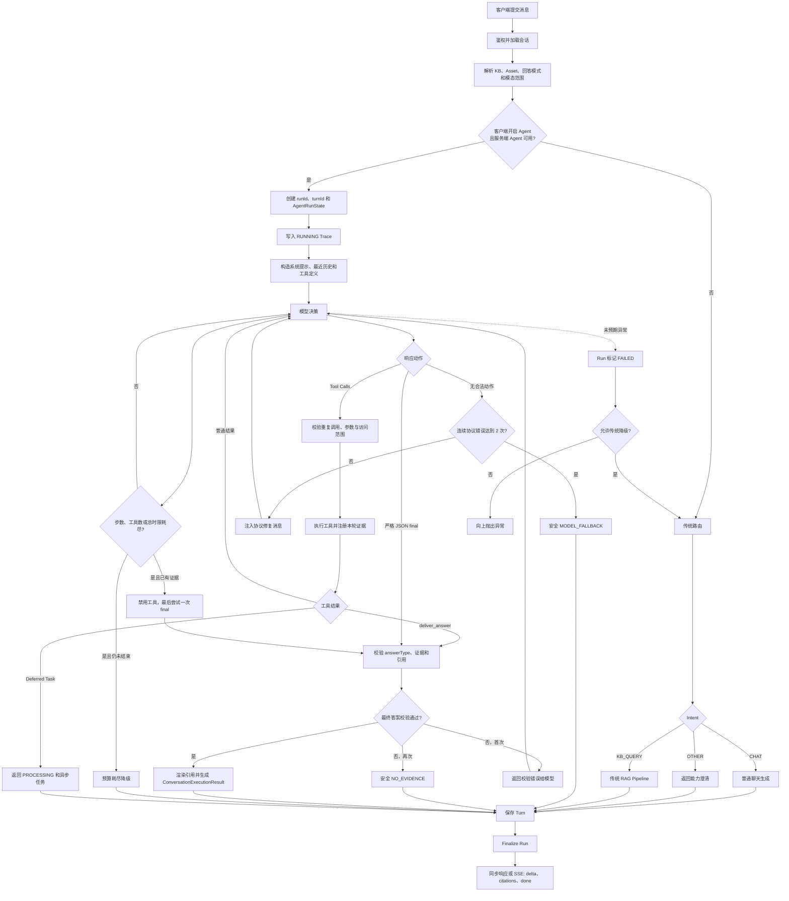
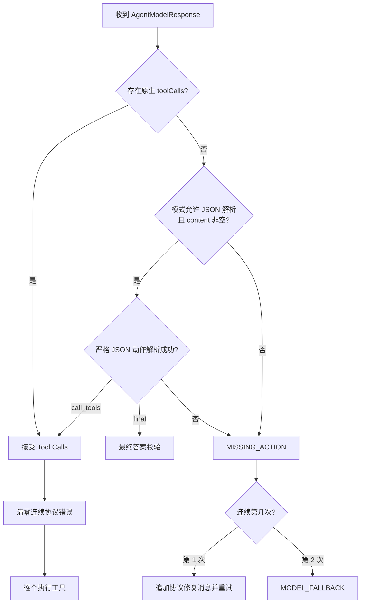
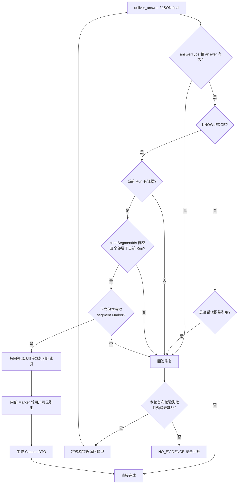
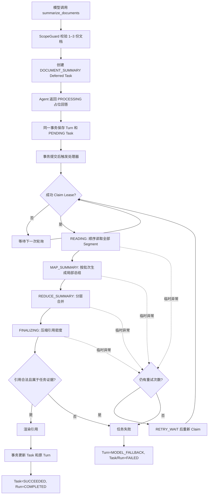
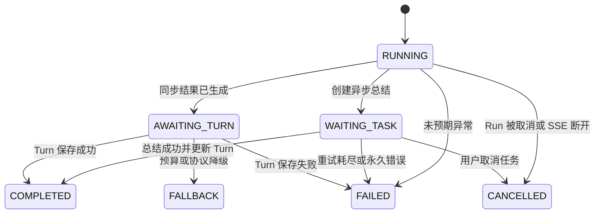

# Anchr Agent RAG 完整工作流

> 文档基于当前 `anchr-app` 后端实现整理，覆盖同步问答、SSE 流式响应、Agent 工具循环、混合检索、引用校验、异步文档总结、降级、取消、持久化和可观测性。
>
> 当前工作流版本：`general-agent-v1`。

## 1. 一页总览

Agent RAG 的核心不是固定执行一次“改写 → 检索 → 生成”，而是让模型在受控状态机中反复选择工具。后端负责工具权限、预算、证据注册、最终答案校验和引用渲染，模型不能绕过这些约束直接提交知识型答案。



## 2. 请求入口与上下文准备

### 2.1 API 入口

| 场景 | API | 行为 |
| --- | --- | --- |
| 同步问答 | `POST /api/v1/conversations/{sessionId}/messages` | 等待完整执行结果后返回 JSON |
| 流式问答 | `POST /api/v1/conversations/{sessionId}/messages/stream` | 后台执行，通过 SSE 发送过程和答案 |
| 查询 Run | `GET /api/v1/agent/runs/{runId}/activity` | 返回 Run 状态、步骤、工具、Token 和耗时 |
| 取消 Run | `POST /api/v1/agent/runs/{runId}/cancel` | 中断仍处于 `RUNNING` 的同步 Agent Run |
| 查询异步任务 | `GET /api/v1/agent/tasks/{taskId}` | 返回总结任务进度、答案和引用 |
| 取消异步任务 | `POST /api/v1/agent/tasks/{taskId}/cancel` | 取消 `PENDING/RUNNING` 任务并更新 Turn 与 Run |

消息请求的主要字段：

| 字段 | 作用 |
| --- | --- |
| `query` | 用户问题，最多 1000 字符 |
| `kbIds` | 知识库范围；为空时可继承会话范围 |
| `assetIdList` | 显式文档范围；非空时所有文档工具都必须受其约束 |
| `limit` | 检索结果数量，范围 1–200 |
| `answerMode` | `STRICT`、`SUMMARY` 或 `EXPLORE` |
| `preferredModalities` | `TEXT`、`IMAGE` 或 `MIXED` |
| `agentEnabled` | 客户端是否希望使用 Agent；还必须满足服务端 `app.agent.enabled=true` |

### 2.2 会话与范围归一化

`ConversationServiceImpl` 在进入编排器前完成：

1. 查询未软删除的会话，不存在则返回 `CONVERSATION_SESSION_NOT_FOUND`。
2. 当请求未指定 `kbIds` 时，继承会话保存的知识库范围；否则通过 `KbScopeResolver` 收敛为当前可见范围。
3. 默认回答模式为 `STRICT`。
4. 默认检索模态为 `MIXED`。
5. 为本次请求生成独立的 `turnId` 和 `runId`。

## 3. Agent 启用条件与传统路径

只有以下条件同时满足才进入 Agent：

```text
request.agentEnabled == true
app.agent.enabled == true
AgentWorkflow Bean 可用
```

否则进入传统路由：

- `CHAT`：调用普通聊天模型，不执行知识检索。
- `OTHER`：返回能力范围澄清。
- `KB_QUERY`：进入传统 RAG Pipeline。

Agent 路径本身不预先调用 Intent Router，模型通过工具选择自主决定聊天、澄清、知识检索或文档总结。只有 Agent 抛出未预期异常并允许传统降级时，才重新执行 Intent Router。

## 4. Agent Run 初始化

### 4.1 状态对象

每个 Run 创建独立 `AgentRunState`，保存：

- 请求上下文：`runId`、`turnId`、`sessionId`、`userId`、KB/Asset 范围。
- 模型消息列表。
- 当前 Run 已注册的证据，以 `segmentId` 去重。
- 已执行工具调用集合，用于拒绝重复调用。
- 模型步骤数、工具调用数、Prompt/Completion Token。
- 连续协议错误数和最终答案校验错误数。
- Trace 顺序与当前步骤。

### 4.2 历史消息

模型上下文由以下内容组成：

1. 固定系统提示。
2. 最近最多 10 个 Turn。
3. 每个历史问题和回答最多截取 1200 字符。
4. 历史总字符数最多 12000。
5. 历史回答中的旧引用 `[1]`、`[1-1]` 会被移除，防止模型把旧 Run 引用当作当前证据。
6. 最后追加当前用户问题。

### 4.3 预算

默认预算：

| 预算 | 默认值 | 触发条件 |
| --- | ---: | --- |
| 最大模型步骤 | 12 | `stepCount >= maxSteps` |
| 最大工具调用 | 8 | `toolCallCount >= maxToolCalls` |
| Run 总时限 | 90 秒 | 当前时间达到 Deadline |
| 单次模型时限 | 30 秒 | 还会被 Run 剩余时间进一步收紧 |

预算耗尽后：

- 若本轮已有证据且仍有时间，禁用所有工具，再请求模型提交一次最终回答。
- 仍未完成则返回本地澄清文本，`AnswerStatus=NO_EVIDENCE`，`fallbackReason=agent_budget_exhausted`。

## 5. 模型调用协议

### 5.1 工具调用模式

| 模式 | 行为 |
| --- | --- |
| `NATIVE` | 只使用 OpenAI 兼容的原生 `tools/tool_calls` |
| `JSON` | 不向接口发送原生工具，要求模型输出严格动作 JSON |
| `AUTO` | 优先原生工具；原生请求异常且仍有剩余时限时，回退 JSON 模式 |

原生模式默认配置：

- `tool_choice=required`，可配置为 `auto`。
- 禁止并行工具调用：`parallelToolCalls=false`。
- 禁止 Spring AI 内部自动执行工具，由业务状态机统一执行。
- 温度 `0.2`，最大输出 Token `1500`。

JSON 模式只接受：

```json
{"action":"call_tools","toolCalls":[{"id":"call_1","name":"工具名","arguments":{}}]}
```

或：

```json
{"action":"final","answerType":"CHAT|CLARIFICATION|KNOWLEDGE","answer":"最终回答","citedSegmentIds":[]}
```

### 5.2 响应处理



普通 Markdown 或自然语言即使语义正确，也不是合法 Agent 动作。连续第一次错误会重试；合法工具调用会清零协议错误；连续第二次错误返回安全降级，不抛工作流异常。

## 6. Agent 工具矩阵

| 工具 | 适用场景 | 关键输入 | 输出/副作用 | 是否注册证据 |
| --- | --- | --- | --- | --- |
| `find_documents` | 不确定目标文档，按名称、标题或内容描述找文档 | `query`、`limit<=10` | 文档列表、真实 `assetId`、匹配片段 | 是，注册检索命中的 Segment |
| `search_knowledge` | 查询事实、定义、规则、流程和相关内容 | `query`、可选 `assetIds`、`limit<=10`、模态 | 改写后的查询和可引用证据 | 是 |
| `read_document` | 按原始顺序连续阅读一份已定位文档 | `assetId`、`cursor`、`limit<=20` | 分页 Segment、`nextCursor`、`hasMore` | 是 |
| `summarize_documents` | 明确要求总结、分析或比较 1–3 份文档 | `assetIds`、`instruction`、`language` | 创建 `DOCUMENT_SUMMARY` 异步任务 | 否，任务自行读取全文证据 |
| `deliver_answer` | 提交 CHAT、CLARIFICATION 或 KNOWLEDGE 最终回答 | `answerType`、`answer`、`citedSegmentIds` | 进入最终答案校验 | 否 |

### 6.1 参数与权限校验

`AgentToolExecutor` 统一执行：

1. 工具是否注册；否则 `UNKNOWN_TOOL`。
2. JSON 参数能否反序列化。
3. Jakarta Validation 注解是否满足；否则 `INVALID_ARGUMENTS`。
4. 业务异常映射为稳定错误码。
5. 安全异常映射为 `PERMISSION_DENIED`。
6. 未知异常映射为 `TOOL_EXECUTION_FAILED`。

工具错误会作为 Tool Message 返回模型，让模型修复参数或选择其他工具，不会直接结束 Run。

### 6.2 文档范围保护

`read_document` 和 `summarize_documents` 通过 `AgentScopeGuard` 定位文档：

1. 优先把输入当作 `assetId`，并在授权 KB 内查找。
2. 若不是 ID，再在授权范围内按完整文件名或标题精确匹配。
3. 多个同名文档返回 `AMBIGUOUS_DOCUMENT`。
4. 未找到返回 `DOCUMENT_NOT_FOUND`。
5. 请求设置了显式 `assetIdList` 时，越界访问返回 `PERMISSION_DENIED`。

模型应复用 `find_documents.documents[].assetId`，不能把 `matchedSegmentId` 当作 `assetId`。

### 6.3 重复调用保护

每次工具调用使用以下 Key 去重：

- 有 `call.id`：直接使用 ID。
- 无 ID：使用 `toolName + arguments`。

重复调用不会再次执行，只会向模型返回 `DUPLICATE_TOOL_CALL`。

## 7. RAG 检索子流程

`search_knowledge` 会先做对话感知 Query Rewrite，再进入统一检索；`find_documents` 则结合资产元数据查找和统一检索。

```mermaid
flowchart LR
    A[工具查询] --> B[Query Rewrite]
    B --> B1{模型改写成功?}
    B1 -- 否 --> B2[回退原始查询]
    B1 -- 是 --> C[独立检索查询]
    B2 --> C

    C --> D[解析 KB、Asset、模态过滤器]
    D --> E[生成 Query Embedding]
    E --> F1[全文/关键词召回]
    E --> F2[向量召回]
    F1 --> G[RRF 按 segmentId 融合]
    F2 --> G
    G --> H[截取有竞争力的 Rerank Window]
    H --> I{Rerank 成功?}
    I -- 是 --> J[检索分数与 Rerank 分数融合]
    I -- 否 --> K[保留 RRF 顺序]
    J --> L[按 Asset 聚合 Top Chunks]
    K --> L
    L --> M[转换 ConversationRetrievalCandidate]
    M --> N[加入当前 Run Evidence Registry]
```



### 7.1 Query Rewrite

- 使用最近最多 5 个 Turn。
- 历史上下文最多 6000 字符，每个字段最多 1200 字符。
- 当前问题最多 2000 字符。
- 模型必须输出严格 JSON。
- 超时、异常或格式错误时使用用户原始查询。

### 7.2 混合召回

1. 根据请求 Limit 和候选倍率计算 `recallTopK`，不超过最大候选数。
2. 对同一查询生成 Embedding。
3. 执行文本召回和向量召回。
4. 以 `segmentId` 合并，并用 Reciprocal Rank Fusion 排序：

```text
RRF(segment) = Σ 1 / (rankConstant + rankIndex + 1)
```

### 7.3 Rerank

- 只对有竞争力的候选窗口调用 Rerank，控制模型成本和延迟。
- 默认窗口 40，最小 20，最大 80。
- 默认融合权重：标准化检索分数 `0.6`，Rerank 分数 `0.4`。
- Rerank 异常或空结果时保留 RRF 顺序。

### 7.4 文档阅读

`read_document` 不做相关度排序，而是按 `chunkOrder + segmentId` 顺序分页读取：

- 每页最多 20 个 Segment。
- 单次返回正文总量最多约 20000 字符。
- 仍有内容时返回 Base64 URL-safe `nextCursor`。
- 返回的每个 Segment 都注册为本轮可引用证据。

## 8. 证据注册与最终答案校验

### 8.1 Evidence Registry

所有知识证据只在当前 Run 内有效，以 `segmentId` 注册到 `AgentRunState.evidence`：

```text
segmentId -> ConversationRetrievalCandidate
```

历史回答的引用、模型自行编造的 Segment ID，以及未被本轮工具返回的证据都不能用于最终答案。

### 8.2 Answer Type 校验

| `answerType` | 规则 |
| --- | --- |
| `CHAT` | 可以无证据；禁止 `citedSegmentIds` 和 Segment Marker |
| `CLARIFICATION` | 可以无证据；禁止引用 |
| `KNOWLEDGE` | 必须存在本轮证据，必须引用本轮证据，并在正文相应结论后放置 Marker |

### 8.3 KNOWLEDGE 校验顺序



模型内部引用格式：

```text
结论内容 {{segment:真实SegmentID}}
```

后端会：

1. 删除模型自行写入的 `[数字]` 引用。
2. 只识别属于本轮 Evidence Registry 的 Marker。
3. 按回答中首次出现顺序分配文档索引和文档内 Segment 索引。
4. 把 Marker 渲染成 `[1-1]`、`[1-2]`、`[2-1]`。
5. 生成带 `kbId`、`assetId`、`segmentId`、页码、锚点和命中原因的 Citation。

最终答案校验错误独立计数：首次失败让模型修复；再次失败返回 `NO_EVIDENCE`，避免无限循环。

## 9. 异步文档总结工作流

`summarize_documents` 不在同步 Agent 循环里读取和总结全文。它返回 `AgentDeferredTask`，先保存占位 Turn，再由后台任务处理。



### 9.1 默认限制

| 限制 | 默认值 |
| --- | ---: |
| 文档数 | 1–3 |
| 最大 Segment 数 | 500 |
| 最大正文字符 | 500000 |
| Map/Reduce 批次字符 | 12000 |
| 任务总时限 | 10 分钟 |
| 单次总结模型时限 | 90 秒 |
| Lease | 2 分钟 |
| 最大重试 | 2 |
| 轮询间隔 | 5 秒 |

### 9.2 Map–Reduce 总结

1. `READING`：按文档原始 Segment 顺序读取全文。
2. `MAP_SUMMARY`：以约 12000 字符切批，每批保留 `{{segment:id}}`。
3. `REDUCE_SUMMARY`：循环合并多个批次，直到形成单一草稿。
4. `FINALIZING`：压缩重复引用，必要时再修复一次。
5. 最终限制：最多 10 个不同引用、12 个 Marker、每段最多 3 个 Marker。

任务执行使用数据库 Lease 保证单任务单 Owner；Lease 过期的 `RUNNING` 任务可以被重新 Claim。

## 10. 持久化与状态机

### 10.1 数据表

| 表 | 作用 |
| --- | --- |
| `conversation_session` | 会话和默认 KB/Asset 范围 |
| `conversation_turn` | 用户问题、答案、引用、执行模式、Run/Task 关联 |
| `agent_run` | Run 状态、步骤数、工具数、Token、耗时、降级和错误 |
| `agent_step` | 每个模型决策、工具结果和异步任务阶段 |
| `agent_task` | 异步总结任务、Lease、进度、重试、答案和错误 |

### 10.2 两阶段 Run 完成

同步 Agent 生成结果时不会立即写成最终 `COMPLETED`：

1. Agent 开始：`agent_run=RUNNING`。
2. Agent 得到同步结果：Trace 暂存为 `AWAITING_TURN`。
3. 事务锁定未删除会话并保存 `conversation_turn`。
4. Turn 保存成功后，`AgentRunFinalizer` 把 Run 更新为 `COMPLETED` 或 `FALLBACK`。
5. Turn 保存失败则 Run 更新为 `FAILED/turn_persistence_failed`。

异步任务则为：

```text
RUNNING -> WAITING_TASK -> COMPLETED | FAILED | CANCELLED
```

常见 Run 状态：



## 11. SSE 事件序列

流式接口不是逐 Token 调用模型，而是在工作流完成后把最终答案按每块最多 48 字符发送。执行过程通过 `trace` 事件实时上报。

| SSE Event | 典型内容 | 时机 |
| --- | --- | --- |
| `trace` | `agent_thinking/started` | 开始处理 |
| `trace` | `decision_completed` | 完成一次模型决策 |
| `trace` | `tool_call/started` | 开始工具调用 |
| `trace` | `tool_result/completed|failed` | 工具完成或失败 |
| `trace` | `protocol_retry|protocol_fallback` | 协议修复或安全降级 |
| `trace` | `answer_repair_required` | 最终答案校验失败，需要模型修复 |
| `trace` | `task_queued/completed` | 异步任务已创建 |
| `delta` | `{"text":"..."}` | 最终答案分块 |
| `citations` | Citation 列表 | Delta 结束后 |
| `done` | Turn、Run、状态、模式、Task 等元数据 | 正常完成 |
| `error` | 错误码和消息 | 业务异常或内部异常 |

客户端断开或 SSE 超时时：

1. 记录当前活动 `runId`。
2. `AgentRunCancellationRegistry` 设置取消标记并中断执行线程。
3. 模型 Future 或工具执行结束后再次检查取消状态。
4. Run 返回 `CANCELLED`；断开的连接不再发送答案。

## 12. 降级与错误矩阵

| 场景 | 局部处理 | 最终状态/路径 |
| --- | --- | --- |
| Query Rewrite 失败 | 使用原始 Query | 继续检索 |
| Embedding 为空 | 抛业务异常 | 由上层异常路径处理 |
| Rerank 失败或空结果 | 保留 RRF 顺序 | 继续生成答案 |
| 工具参数错误 | Tool Error 返回模型 | 模型修复后重试 |
| 重复工具调用 | 返回 `DUPLICATE_TOOL_CALL` | 不重复执行 |
| 第一次无合法 Agent 动作 | 注入协议错误消息 | 重试模型 |
| 连续第二次无合法动作 | 本地安全回答 | `MODEL_FALLBACK/FALLBACK` |
| 第一次最终答案校验失败 | 校验错误返回模型 | 修复答案 |
| 再次最终答案校验失败 | 本地证据不足回答 | `NO_EVIDENCE` |
| Agent 预算耗尽 | 有证据时再做一次无工具 Final | 否则 `NO_EVIDENCE/FALLBACK` |
| Agent 未预期异常 | Run 标记 `FAILED` | 若开启配置则进入传统路由，执行模式 `AGENT_FALLBACK` |
| 传统 RAG 无合格证据 | 固定无证据模板 | `NO_EVIDENCE` |
| 传统答案模型格式错误 | 用证据拼接保守答案 | `MODEL_FALLBACK` |
| 异步总结临时失败 | 延迟重试 | 重试耗尽后 `FAILED` |
| 异步总结永久错误 | 不重试 | Turn 更新为 `MODEL_FALLBACK` |

## 13. 传统 RAG Pipeline

Agent 关闭或 Agent 异常降级时，`KB_QUERY` 执行固定 Pipeline：

```text
Query Rewrite
  -> Unified Search
  -> Result Card Mapping
  -> 选择最多 5 个可追溯候选
  -> Citation Mapping
  -> Grounded Answer Generation
  -> 只保留答案实际使用的 Citation
  -> 生成引用原因
```

回答模式策略：

| 模式 | Grounding 数 | 最少证据字符 | 最低 Top Score | 是否允许推测 |
| --- | ---: | ---: | ---: | --- |
| `STRICT` | 5 | 80 | 0.12 | 否 |
| `SUMMARY` | 3 | 60 | 0.10 | 否 |
| `EXPLORE` | 5 | 40 | 0.08 | 是，且必须明确标注 |

传统答案模型必须输出 `ANSWERED|NO_EVIDENCE` 严格 JSON，并使用 `[1]` 形式引用输入证据。后端会校验引用范围、规范化文档索引，并只保留答案实际使用的 Segment。

## 14. 可观测性

### 14.1 Trace

模型决策步骤记录：

- 模型名称和 `finishReason`。
- 消息数、是否允许工具、计划工具数。
- 是否存在文本内容。
- Prompt/Completion Token 和耗时。

工具步骤记录：

- 工具名、Call ID、成功状态和错误码。
- 耗时、证据数、文档数、Segment 数、分页状态。

异步任务阶段固定使用 Trace Order `101–106`，覆盖 `READING`、`MAP_SUMMARY`、`REDUCE_SUMMARY`、`FINALIZING`、`RETRY_WAIT` 和终态。

### 14.2 主要 Metrics

- `agent.step.latency`
- `agent.model.tokens`
- `agent.run.count`
- `agent.steps`
- `agent.tool.calls`
- `agent.run.tokens`
- `agent.protocol.error`
- `agent.run.result`
- `agent.workflow.fallback.count`
- `conversation.retrieval.latency`
- `conversation.retrieval.topk`
- `kb.search.rerank.calls`
- `kb.search.rerank.fallback`
- `answer.generate.fallback.count`
- `no_evidence.answer.rate`

Trace 只保存响应形态和摘要，不保存完整模型回答或思维链。

## 15. 安全与可靠性边界

1. 用户输入、历史消息、文档正文和工具结果都被视为不可信数据。
2. 模型只能调用注册工具，不能扩大 KB/Asset 权限。
3. 文档工具必须通过服务端范围校验，不能相信模型提供的 ID。
4. KNOWLEDGE 回答只能引用当前 Run 已注册证据。
5. 后端删除模型伪造的数字引用，只渲染合法 Segment Marker。
6. 异步任务使用 Lease、Owner 和条件更新防止多实例重复写入。
7. 保存 Turn 前会锁定未删除会话，避免会话删除与回答落库竞态。
8. 删除会话时会中断活动 Run/Task，并删除 Agent Trace 与 Task 记录。

## 16. 关键配置

| 配置 | 默认值 | 说明 |
| --- | --- | --- |
| `APP_AGENT_ENABLED` | `true` | 服务端 Agent 总开关 |
| `APP_AGENT_WORKFLOW_VERSION` | `general-agent-v1` | 工作流版本 |
| `APP_AGENT_TOOL_CALL_MODE` | `AUTO` | `NATIVE/JSON/AUTO` |
| `APP_AGENT_NATIVE_TOOL_CHOICE` | `REQUIRED` | 原生工具选择约束 |
| `APP_AGENT_FALLBACK_TO_TRADITIONAL` | `true` | 未预期 Agent 异常时是否进入传统路径 |
| `APP_AGENT_MAX_STEPS` | `12` | 最大模型决策次数 |
| `APP_AGENT_MAX_TOOL_CALLS` | `8` | 最大工具调用次数 |
| `APP_AGENT_TOTAL_TIMEOUT` | `90s` | 同步 Agent 总时限 |
| `APP_AGENT_MODEL_TIMEOUT` | `30s` | 单次 Agent 模型时限 |
| `APP_AGENT_TASK_TIMEOUT` | `10m` | 异步总结总时限 |
| `APP_AGENT_TASK_MODEL_TIMEOUT` | `90s` | 异步单次模型时限 |
| `APP_AGENT_TASK_LEASE` | `2m` | 任务 Lease |
| `APP_AGENT_TASK_MAX_RETRIES` | `2` | 异步最大重试次数 |
| `APP_AGENT_TASK_POLL_INTERVAL` | `5s` | Claim 轮询间隔 |

## 17. 代码导航

| 组件 | 文件 |
| --- | --- |
| REST 入口 | `ConversationController.java` |
| 请求归一化、Turn 保存、SSE | `ConversationServiceImpl.java` |
| Agent/传统路径编排 | `ConversationMessageOrchestrator.java` |
| Agent 状态机 | `AgentWorkflowImpl.java` |
| Agent Run 状态 | `AgentRunState.java` |
| 模型适配与 Tool Choice | `SpringAiAgentModelAdapter.java` |
| 工具注册与参数校验 | `AgentToolRegistry.java`、`AgentToolExecutor.java` |
| 五个 Agent 工具 | `application/agent/tool/` |
| 混合检索 | `UnifiedSearchServiceImpl.java` |
| 检索编排 | `ConversationRetrievalOrchestratorImpl.java` |
| Query Rewrite | `QueryRewriteServiceImpl.java` |
| Agent 引用渲染 | `AgentCitationRenderer.java`、`AgentCitationIndexPlan.java` |
| 异步总结 | `AgentTaskProcessor.java` |
| Run Trace 与终态 | `AgentTraceRecorder.java`、`AgentRunFinalizer.java` |
| 传统 RAG | `ConversationMessagePipeline.java`、`AnswerGenerationServiceImpl.java` |
| 数据库结构 | `V7__create_agent_run_tables.sql` |
