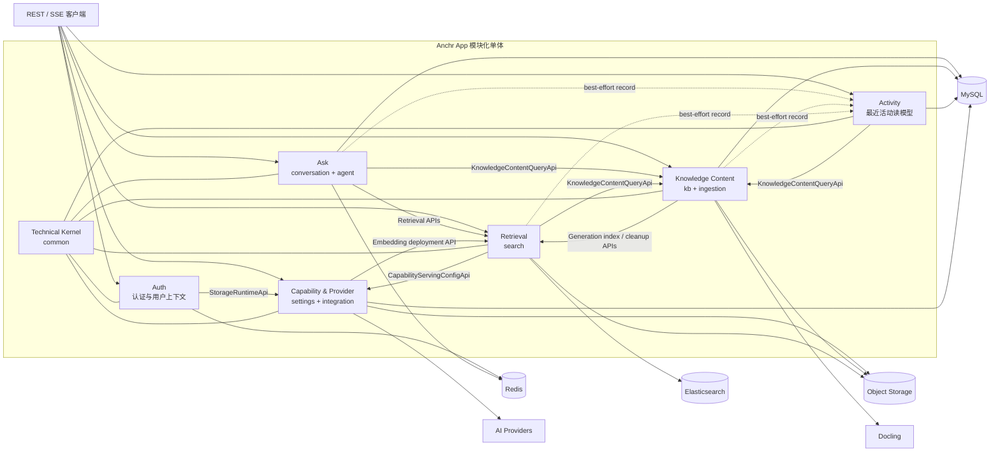
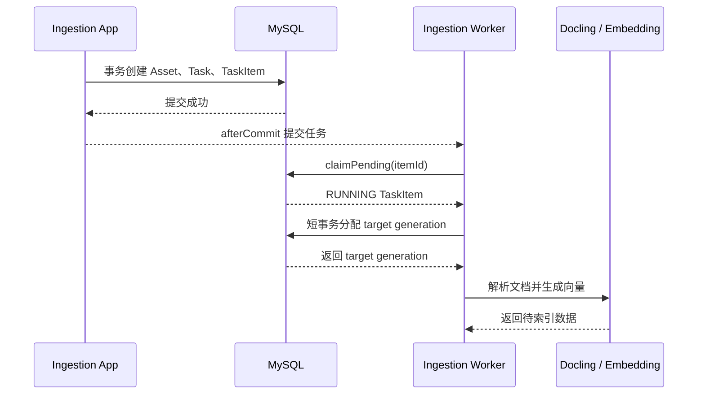
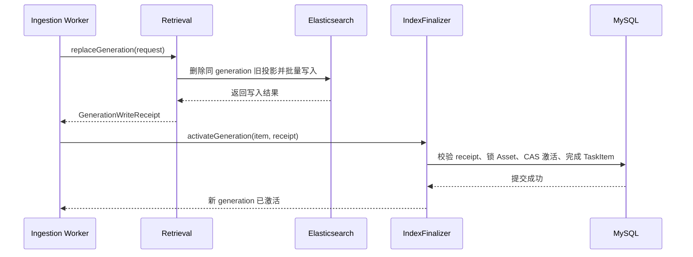
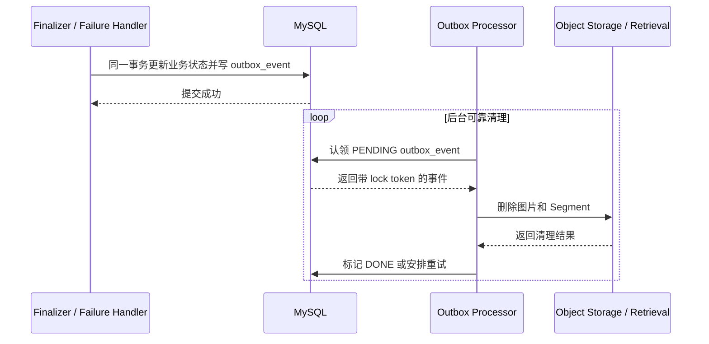

# Anchr App 领域边界与交互实现

本文说明 Anchr App 当前后端实现中的领域边界、状态所有权、公开契约、关键业务交互和一致性策略。

它是一份随代码演进的架构说明。文中的“当前实现”以当前工作区源码和数据库迁移为准。

## 1. 系统形态与阅读约定

Anchr App 后端是一个 Spring Boot 模块化单体。所有模块运行在同一进程中，但业务状态并不共享所有权：

- MySQL 保存业务事实、任务状态和可靠补偿事件。
- Elasticsearch 保存面向检索的 Segment 投影和物理索引拓扑。
- Redis 保存认证信息、ID 号段、查询改写缓存和 Agent 运行时快照等可重建状态。
- 对象存储保存原始文档、预览资源和摄取过程中产生的图片。
- AI、Docling 和对象存储属于进程外供应商能力，通过端口或应用契约接入。

本文使用以下术语：

- **领域上下文**：拥有一组业务规则和最终状态解释权的逻辑边界。
- **物理模块**：`com.anchr.core` 下的一级 Java 包。一个领域上下文可以由多个物理模块共同实现。
- **Application API**：提供方发布的进程内稳定契约，位于 `application.api`。
- **ACL**：调用方拥有的防腐层，位于调用方的 `application.acl`，负责语义转换和依赖收口。
- **Domain Port**：业务侧定义的出站能力接口，由 `integration` 中的供应商适配器实现。
- **业务事实**：出现冲突时具有最终解释权的状态；缓存、投影和活动快照都不是业务事实。

## 2. 领域地图



箭头表示依赖方向，不表示状态归属。跨上下文调用默认经过提供方 Application API 和调用方 ACL；外部供应商能力则由消费侧 Domain Port 与 `integration` 适配器连接。

## 3. 领域边界与状态所有权

### 3.1 Knowledge Content：知识内容与摄取

**物理模块**：`kb`、`ingestion`

**职责**：

- 管理知识库和 Asset 的创建、归档、删除与统计信息。
- 管理上传、幂等创建、摄取任务及任务项状态。
- 编排解析、图片处理、Embedding、索引写入和 generation 激活。
- 决定某个 Asset 当前可见的 `activeIndexGeneration`。
- 管理原始对象、摄取图片的业务生命周期。
- 通过专用 Outbox 可靠清理已删除 Asset 或失效 generation 的外部投影。

**拥有的业务状态**：

- MySQL：`knowledge_base`、`asset`、`ingestion_task`、`ingestion_task_item`、`outbox_event`。
- 对象存储中的原始文档和摄取产物，其位置由业务记录和存储配置共同解析。

`kb` 与 `ingestion` 是两个物理包，但当前属于同一领域上下文。摄取任务创建、generation 预留、Asset 锁定和激活需要共享同一组短事务与业务不变量，因此二者之间存在直接 Repository 和领域类型协作。这不是跨领域访问。

Knowledge Content 不拥有 Elasticsearch 索引结构，也不直接解释检索排序；它只拥有“哪个 generation 可见”的业务事实。

### 3.2 Retrieval：检索与索引投影

**物理模块**：`search`

**职责**：

- 管理 Elasticsearch 物理索引、读写别名和 Embedding profile 兼容性。
- 写入、替换和删除某个 Asset generation 的 Segment 投影。
- 执行关键词、文本向量和文档图片向量召回。
- 执行 RRF 融合、可见 generation 过滤、多样性控制、Rerank 和 Asset 聚合。
- 提供 Segment 预览、文档内容读取、引用理由生成和检索解释。
- 编排 Embedding profile 变更后的索引重建与别名切换。

**拥有的状态**：

- Elasticsearch 中的 Segment 文档、物理索引、读别名和写别名。
- 进程内的索引生命周期状态、待确认重建任务和写入屏障状态。

Retrieval 中的 Segment 是 Knowledge Content 的检索投影，不是 Asset 业务事实。检索命中必须再次查询 Knowledge Content 的可见知识库、有效 Asset 和 active generation，不能仅凭 Elasticsearch 文档判断业务可见性。

### 3.3 Ask：会话、问答与 Agent

**物理模块**：`conversation`，其中 `application.agent` 是 Ask 内部子模块。

**职责**：

- 管理会话和 Turn 生命周期。
- 执行 CHAT、OTHER、KB_QUERY 等意图路由。
- 编排传统 RAG：问题改写、检索、证据筛选、回答生成、引用和结果卡片。
- 编排 Agent 工具循环、运行轨迹、异步任务、恢复、取消和 SSE 推送。
- 保存回答时实际使用的证据快照。

**拥有的业务状态**：

- MySQL：`conversation_session`、`conversation_turn`、`agent_run`、`agent_step`、`agent_task`。
- Redis：Agent 最新运行态快照；它是 best-effort 缓存，MySQL 中的会话、任务和轨迹记录才是权威状态。
- 进程内：Agent 取消注册、运行线程和 SSE 订阅者等瞬时状态。

Ask 不直接拥有知识库、Asset 或 Segment。知识范围通过 `ConversationKnowledgeAcl` 查询，检索和文档内容通过 `ConversationRetrievalAcl` 获取。Agent 是 Ask 的一种执行模式，不是独立业务上下文。

### 3.4 Activity：最近活动读模型

**物理模块**：`activity`

**职责**：

- 保存最近问题、搜索、引用打开和文档导入等 UI 活动。
- 按用户查询最近活动。
- 查询 Knowledge Content 补充当前仍有效的知识库名称。

**拥有的状态**：

- MySQL：`activity_event`。

Activity 中的 payload 是面向展示的事件快照，不是会话、Asset、引用或检索结果的审计真相。记录失败通常不得回滚主业务；删除会话或 Asset 时，与之相关的活动清理则由调用方显式发起。

### 3.5 Capability & Provider：能力配置与供应商适配

**物理模块**：`settings`、`integration`

**职责**：

- 管理生成、Embedding、Rerank 等 AI 能力配置。
- 管理对象存储配置、加密字段和临时访问凭证。
- 解析当前生效配置，创建和缓存供应商客户端。
- 为 Ask、Retrieval、Knowledge Content 和 Auth 实现各自拥有的出站端口。
- 在 Embedding 配置切换时协调 Retrieval 完成索引部署。

**拥有的业务状态**：

- MySQL：`capability_config`、`storage_config`。
- 进程内：供应商客户端缓存。

`settings` 负责配置的业务生命周期，`integration` 负责供应商协议和 SDK 适配，二者共同构成一个支撑上下文。`integration` 可以实现多个语义一致、但由不同消费上下文定义的端口，例如同一个存储适配器同时实现 Ask 之外三个上下文各自的 Object Storage Port；它不向业务层暴露一个万能供应商接口。

### 3.6 Auth 与 Technical Kernel

**物理模块**：`auth`、`common`

`auth` 负责访问令牌、角色、TTL、用户上下文和请求拦截。认证状态主要保存在 Redis；需要对象存储临时凭证时，通过 `AuthStorageAcl` 调用 `StorageRuntimeApi`。

`common` 是技术内核，承载统一返回值、错误码、ID、加密、健康检查和少量稳定技术数据结构。它不是共享业务领域，新的 Asset、Segment、Conversation 或供应商业务模型不应因为“多个模块都要用”而放入 `common`。

## 4. 关键状态与术语所有权

| 术语 | 所有者 | 当前含义 |
| --- | --- | --- |
| Knowledge Base | Knowledge Content | Asset 的业务容器及其可见性、统计状态 |
| Asset | Knowledge Content | 原始文档及其摄取生命周期 |
| target generation | Knowledge Content | 摄取任务项预留、尚待激活的内容版本 |
| active generation | Knowledge Content | 当前允许被业务读取的 Asset 内容版本 |
| Segment | Retrieval | 从某一 Asset generation 派生的检索投影 |
| physical index / alias | Retrieval | Elasticsearch 存储与路由拓扑 |
| Embedding profile | Capability + Retrieval | Capability 管理配置；Retrieval 判断索引兼容性并执行部署 |
| Conversation / Turn | Ask | 用户会话和一次问答的持久化快照 |
| Evidence / Citation | Ask | Ask 注册并实际使用的检索证据；来源数据由 Retrieval 提供 |
| Agent Run / Step / Task | Ask | Agent 执行、轨迹和异步调度状态 |
| Activity Event | Activity | 面向最近活动 UI 的快照 |
| Provider Configuration | Capability | AI 和对象存储的期望配置与生效配置 |

需要特别区分三种容易混淆的版本：

1. `asset.active_index_generation` 是内容可见性版本，由 Knowledge Content 激活。
2. Segment 文档中的 generation 标识它来自哪个内容版本，由 Retrieval 保存为投影字段。
3. Elasticsearch 物理索引版本属于 Retrieval 基础设施，可同时容纳多个 Asset generation，与单个 Asset 的 active generation 不是同一概念。

## 5. 模块间交互规则

### 5.1 同一上下文内直接协作

同一领域上下文的物理模块可以直接使用领域对象和 Repository：

- `kb` 与 `ingestion` 共享 Asset、摄取任务和 generation 激活事务。
- `settings` 与 `integration` 共享供应商配置解析、客户端工厂和缓存失效。

直接协作只适用于共享同一业务不变量的模块，不能据此放宽其他上下文的边界。

### 5.2 跨上下文同步调用

跨上下文同步调用遵循：

```text
调用方用例 -> 调用方 ACL -> 提供方 application.api -> 提供方应用服务
```

提供方 API 使用自己的不可变 Application Model；调用方 ACL 将其转换为调用方模型、聚合或命令。REST DTO 不作为进程内领域契约。

当前主要契约如下：

| 调用方 | 调用方 ACL | 提供方 Application API | 用途 |
| --- | --- | --- | --- |
| Auth | `AuthStorageAcl` | `StorageRuntimeApi` | 获取存储位置和临时凭证 |
| Activity | `ActivityKnowledgeAcl` | `KnowledgeContentQueryApi` | 补充有效知识库名称 |
| Ask | `ConversationKnowledgeAcl` | `KnowledgeContentQueryApi` | 校验会话知识范围、查询文档元数据 |
| Ask | `ConversationRetrievalAcl` | `RetrievalHitQueryApi` | 获取面向问答的检索候选 |
| Ask | `ConversationRetrievalAcl` | `RetrievalDocumentContentQueryApi` | Agent 按范围读取文档内容 |
| Ask | `ConversationRetrievalAcl` | `RetrievalCitationReasonApi` | 为已使用证据生成引用理由 |
| Ingestion | `IngestionRetrievalAcl` | `RetrievalGenerationIndexApi` | 写入或替换 generation 投影 |
| Knowledge Content | `KnowledgeRetrievalCleanupAcl` | `RetrievalCleanupApi` | 删除 Asset 或 generation 投影 |
| Retrieval | `SearchKnowledgeAcl` | `KnowledgeContentQueryApi` | 查询可见知识范围和 active generation |
| Retrieval | `RetrievalCapabilityAcl` | `CapabilityServingConfigApi` | 读取、激活 Embedding 生效配置 |
| Capability | `CapabilityRetrievalAcl` | `RetrievalEmbeddingDeploymentApi` | 请求、确认 Embedding 索引部署 |
| 各业务上下文 | 各自 Activity ACL | `ActivityRecordApi` | best-effort 记录活动 |
| Ingestion / Knowledge | 各自 Storage ACL | `StorageRuntimeApi` | 获取存储快照和临时凭证 |

公开搜索接口使用 `RetrievalPageQueryApi` 返回分页结果；Ask 使用 `RetrievalHitQueryApi` 获取可继续参与回答编排的候选。两个入口共享检索核心，但输出语义不同。

### 5.3 外部供应商调用

AI 和对象存储使用消费侧拥有的 Domain Port：

- Ask：`AgentModelPort`、`ConversationGenerationPort`
- Ingestion：`IngestionEmbeddingPort`、`IngestionObjectStoragePort`
- Knowledge Content：`KnowledgeObjectStoragePort`
- Retrieval：`SearchEmbeddingPort`、`SearchGenerationPort`、`SearchRerankPort`、`SearchObjectStoragePort`

`integration` 中的 `ConfigDriven*Adapter` 实现这些端口，并依赖 Capability 配置选择客户端。这样业务规则依赖的是“需要什么能力”，而不是某个供应商 SDK。

Docling 目前通过 `IngestionDoclingAcl` 对接 `integration.ai.client.DoclingClient`。ACL 负责将供应商状态、错误和响应转换为摄取语义。

### 5.4 Process Coordinator、Outbox 与 best-effort

项目没有通用命令总线或全局事件总线，按一致性要求使用三种协调方式：

- **Application Process Coordinator**：一个用例跨多个本地步骤或外部能力时，由应用服务显式编排，例如摄取、问答和索引重建。
- **Knowledge Content 专用 Outbox**：业务事务必须可靠触发 Elasticsearch/对象存储清理时，先持久化 `outbox_event`，再由轮询器执行。
- **after-commit / best-effort**：最近活动、统计刷新、Docling ACK 等不应破坏主业务的副作用，在主事务提交后执行或捕获失败。

## 6. 关键业务交互

### 6.1 文档摄取与 generation 激活

这条链路分为三件事：先把文档处理成可索引数据，再写入并激活新 generation，最后异步清理不再使用的数据。

#### 6.1.1 创建任务并处理文档

一句话：**先提交数据库任务，再由 Worker 调用 Docling 和 Embedding；外部调用不占用数据库事务。**



这里的 `target generation` 是新内容的候选版本。此时它还不是 active generation，对用户检索不可见。

#### 6.1.2 写入索引并激活 generation

一句话：**先写 Elasticsearch，写成功后再用一个短事务把新 generation 切换为可见版本。**



MySQL 与 Elasticsearch 没有分布式事务。系统使用 active generation 作为可见性门闩：

- Elasticsearch 写入失败：不激活，新数据不可见。
- Elasticsearch 写入成功、激活成功：新 generation 可见。
- Elasticsearch 写入成功、激活失败：新数据仍不可见，并登记异步清理。
- 激活成功后，旧 generation 也会登记异步清理。

以已有文档从 generation 3 更新到 generation 4 为例：

- generation 4 构建和写入期间：业务查询仍只读取 active generation 3。
- generation 4 激活事务提交后：业务查询只读取 generation 4。
- Outbox 删除 generation 3 之前：Elasticsearch 中可以同时存在 3 和 4，但应用层不会混读。
- 如果是首次导入，active generation 初始为 0，没有老数据可读；generation 1 激活前，该文档不会出现在业务检索结果中。

#### 6.1.3 Outbox 异步清理

一句话：**业务事务只负责可靠登记“需要清理什么”，后台 Processor 再真正删除外部数据。**



任一解析、Embedding、索引写入或 Finalizer 异常都会进入 `failRunning` 短事务：任务被标记失败；如果 target generation 尚未激活，同时写入它的清理事件；随后再执行 best-effort Docling ACK。

当前实现要点：

1. `IngestionApplicationServiceImpl` 是摄取门面，创建、维护和查询由更小的用例协作完成。
2. 创建任务使用 `IngestionCreateTransactionRunner` 的 `REQUIRES_NEW` 事务。并发幂等竞争的失败方先完整回滚，再在新事务中读取成功方结果。
3. Worker 认领任务项后，`IngestionStageTransactionCoordinator` 锁定 Asset 并预留 `targetIndexGeneration`。外部解析、Embedding 和 Elasticsearch 写入不占用长 MySQL 事务。
4. Retrieval 先删除同一 Asset/generation 的旧投影，再批量写入并返回 `RetrievalGenerationWriteReceipt`。
5. `IngestionIndexFinalizer` 在短事务中锁定任务项和 Asset，校验 receipt 后使用 CAS 激活 generation。
6. Elasticsearch 已写入但尚未激活的 generation 对查询不可见。激活失败、重试覆盖或旧 generation 淘汰时，通过 Outbox 清理投影和摄取图片。
7. 当前 Worker 不假装恢复进程重启前的外部供应商调用。启动时残留的 `RUNNING` 任务项会被标记失败，用户以整文档重试恢复。

这里没有 MySQL 与 Elasticsearch 的分布式事务。可见性门闩是 active generation，最终清理由 Outbox 保证。

### 6.2 检索、可见性过滤与预览

检索链路为：

```text
REST Search 或 Ask
  -> Retrieval Query API
  -> KnowledgeContentQueryApi 解析可见知识范围
  -> 查询向量生成
  -> 关键词 + 文本向量 + 文档图片向量召回
  -> RRF 融合
  -> 按 Knowledge Content active generation 过滤
  -> 多样性控制与有界 Rerank
  -> Asset 聚合 / Hit 输出
```

关键约束：

- Elasticsearch 召回结果只是候选，必须经过 Knowledge Content 的 active generation 过滤。
- 过滤发生在召回之后，因此旧 generation 即使尚未被 Outbox 物理删除，也不会成为业务可见结果。
- Segment 预览会再次校验 Asset 与 generation 是否有效；过期 Segment 返回不可见，而不是直接暴露 Elasticsearch 内容。
- 文档元数据和可见范围通过 `SearchKnowledgeAcl` 获取，对象预览 URL 通过 `SearchObjectStoragePort` 签发。
- 搜索活动由接口层在成功返回后通过 `SearchActivityAcl` 记录，不参与检索结果的一致性。

### 6.3 传统 RAG 与 Agent 问答

`ConversationServiceImpl` 是接口层门面，核心入口由 `ConversationMessageUseCase` 和 `ConversationMessageOrchestrator` 编排。

传统问答流程：

1. 加载或创建会话，并通过 `ConversationKnowledgeAcl` 解析用户可见知识范围。
2. 生成 Turn/Run 标识，执行意图路由。
3. CHAT 或 OTHER 直接走生成能力；KB_QUERY 先改写查询，再通过 `ConversationRetrievalAcl` 检索。
4. 将候选转换为结果卡片和可引用证据，生成回答。
5. 只保留回答实际使用且仍有效的引用，并通过 Retrieval 生成引用理由。
6. 在事务中保存 Turn；成功后 best-effort 记录 QUESTION 活动。

Agent 模式复用相同的知识范围和检索边界：

- `find_documents`、`search_knowledge`、`read_document`、`summarize_documents`、`deliver_answer` 等工具由 Ask 编排。
- Scope Guard 和文档读取通过 `ConversationKnowledgeAcl`、`ConversationRetrievalAcl` 完成，不把 Knowledge Repository 或 Elasticsearch Repository 暴露给 Agent。
- Agent Run、Step 和 Task 持久化到 MySQL；异步任务先保存，再在事务提交后触发，调度器可继续认领未完成任务。
- Redis Runtime Snapshot 仅用于快速展示最新运行状态，读取或写入失败不改变 MySQL 中的权威状态。
- SSE 是传输和订阅机制，不另建一套问答业务流程。

### 6.4 Embedding 配置部署与索引切换

Embedding 配置的“已保存”和“已生效”是两个状态：

1. Capability 保存配置。若待选 Embedding profile 与当前生效 profile 的指纹不兼容，不立即切换配置。
2. `CapabilityConfigServiceImpl` 通过 `CapabilityRetrievalAcl` 请求 Retrieval 创建待确认重建任务。
3. 用户确认后，`SegmentIndexManagerImpl` 获取 `SegmentIndexWriteBarrier` 独占许可，检查当前别名拓扑，创建新物理索引并迁移/重新生成投影。
4. 校验文档数量和 profile 后切换读写别名，再通过 `RetrievalCapabilityAcl` 激活 Capability 配置。
5. 若配置激活失败，Retrieval 尝试把别名切回旧物理索引。新索引只有在不再被别名引用时才会删除。
6. 成功后保留旧物理索引作为显式回滚快照，不自动把它当作垃圾删除。

普通 Segment 写入持有写入屏障的共享许可；重建持有独占许可，避免别名切换期间仍有迟到写入落到旧索引。

当前待确认重建任务和生命周期状态保存在进程内。进程重启后可以根据 Elasticsearch 拓扑重新检查实际状态，但尚未确认的任务本身不是数据库中的持久业务任务。

### 6.5 Asset 删除与可靠清理

删除 Asset 时，Knowledge Content 在同一 MySQL 事务中：

1. 锁定并更新 Asset 业务状态。
2. 清理与 Asset 关联的引用活动。
3. 更新知识库统计。
4. 保存 `DELETE_ASSET` Outbox 事件。

如果 Outbox 写入失败，Asset 删除事务回滚，避免“业务已删但永远没有外部清理记录”。

generation 切换或摄取失败会保存 `DELETE_ASSET_GENERATION`。`OutboxEventProcessor` 使用 lock token 和租约批量认领事件，在数据库事务外执行：

- 删除对应 Asset/generation 的摄取图片前缀。
- 通过 `RetrievalCleanupApi` 删除 Elasticsearch Segment 投影。

操作按 Asset/generation 设计为幂等。临时失败按 1、5、30、120、720、1440 分钟退避，后续重试继续使用最大间隔；默认最多尝试 10 次。非法 payload 直接进入失败状态。已完成事件默认保留 90 天，每天 03:00（Asia/Shanghai）批量清理。

该 Outbox 只承载 Knowledge Content 外部清理，不是全局集成事件平台。

### 6.6 Activity 记录与清理

Activity 是弱一致读模型：

- Ask、Search 和 Ingestion 在主流程成功或提交后记录活动。
- 调用方 ACL 以及记录服务会隔离写入异常；Activity 故障不回滚回答、搜索或摄取。
- 最近活动查询会调用 `KnowledgeContentQueryApi` 补充当前有效的知识库名称。
- 删除会话或 Asset 时，调用方显式执行相关 Activity 删除；这是生命周期清理，不应被当作普通 best-effort 展示事件。

### 6.7 Storage 与 Docling

Capability 通过 `StorageRuntimeApi` 发布存储位置快照和临时凭证。业务上下文只保存或传递业务需要的对象键，不直接读取其他上下文的配置 Repository。

`ConfigDrivenStorageAdapter` 根据当前配置解密凭证并实现各消费侧 Object Storage Port。Ingestion 在提交 Docling 任务前固定目标 endpoint、bucket 和 prefix，并在签发临时凭证时检查目标没有漂移，避免解析任务写入与原请求不一致的位置。

`DoclingClient` 使用带认证的异步 HTTP 作业协议，并限制响应体大小。Ingestion 负责提交、轮询、退避、错误分类和最终 ACK；供应商调用不被包装进长数据库事务。

## 7. 一致性与失败语义

| 边界 | 一致性策略 | 失败后的系统语义 |
| --- | --- | --- |
| 单个 MySQL 聚合/任务状态 | 本地事务、行锁、CAS | 事务回滚，不暴露部分业务状态 |
| MySQL Asset 与 Elasticsearch Segment | target/active generation 门闩 + Outbox | 未激活投影不可见；异步清理孤儿或旧投影 |
| Embedding 配置与索引别名 | 写入屏障、迁移校验、先切别名后激活配置、失败回切 | 尽量恢复旧拓扑；旧索引保留供显式回滚 |
| Activity 与主业务 | after-commit / best-effort | 最多缺少最近活动，不改变业务结果 |
| Agent Redis 快照与 MySQL | Redis best-effort、MySQL 权威 | 缓存可缺失或短暂过期，任务和轨迹仍可恢复 |
| Agent 异步触发 | 任务先持久化，提交后触发 | 即时触发失败时，持久任务仍可被后续调度认领 |
| AI / Docling / Object Storage | 超时、错误分类、有限重试或补偿 | 不承诺 XA；由具体用例决定失败、重试或降级 |
| 进程内索引重建任务 | 原子状态 + ES 拓扑复核 | 重启后待确认任务不保留，实际别名状态可重新检查 |

## 8. 当前代码中的边界例外

当前实现仍有少量包级直接依赖，阅读和后续修改时需要区分“有意的同上下文协作”和“尚未完全收口的表示层耦合”：

- `kb <-> ingestion`、`settings <-> integration` 是本文定义的同上下文协作。
- `integration` 依赖 Ask、Ingestion、Retrieval、Knowledge Content 的 Domain Port，是六边形架构中的出站适配器依赖方向。
- Ingestion 已用自己的 `IngestionIndexSegment` 表达待写入数据，generation 写入边界也已通过 `RetrievalGenerationIndexApi` 收口；但 Embedding 准备阶段仍直接复用 Retrieval 的 `EmbeddingProjectionPolicy`、`EmbeddingProjection`、`SegmentType` 等领域类型。
- Activity REST DTO/Assembler 仍复用 Retrieval 接口层的 `CitationChunkSnapshotDTO` 和 `PreviewAnchorDTO`。这是当前表示层耦合，不代表 Activity 拥有 Retrieval 领域状态。
- Segment Preview 通过 `SearchKnowledgeAcl` 查询 Knowledge Content 发布模型来完成可见性校验，这是合规调用；新的跨边界需求也应优先扩展 Application API/ACL，而不是增加直接 Repository 或领域模型依赖。

这些例外用于描述现状，不应被当作新增跨领域直接依赖的先例。

## 9. 变更时的边界检查

新增或修改跨模块流程时，至少回答以下问题：

1. 谁拥有最终业务状态，发生冲突时以哪个存储为准？
2. 这是同上下文协作、同步 Query/Command、外部能力调用，还是需要可靠补偿的跨存储流程？
3. 提供方是否通过 `application.api` 发布稳定语义，调用方是否通过自己的 ACL 隔离模型？
4. 外部系统调用是否被错误地放进长 MySQL 事务？
5. 缓存、Activity、Segment 或 SSE 快照是否被误当成业务事实？
6. 重试是否幂等，失败后由谁恢复、补偿或标记终态？
7. 新类型属于提供方契约、调用方模型、Domain Port，还是纯技术内核？
8. 对 active generation、Embedding profile、索引别名和任务状态的修改，是否保持本文描述的不变量？

## 10. 主要源码入口

### Knowledge Content 与 Ingestion

- [`KnowledgeContentQueryApi`](../src/main/java/com/anchr/core/kb/application/api/KnowledgeContentQueryApi.java)
- [`KnowledgeContentQueryApiImpl`](../src/main/java/com/anchr/core/kb/application/impl/KnowledgeContentQueryApiImpl.java)
- [`IngestionApplicationServiceImpl`](../src/main/java/com/anchr/core/ingestion/application/impl/IngestionApplicationServiceImpl.java)
- [`IngestionTaskProcessorImpl`](../src/main/java/com/anchr/core/ingestion/application/impl/IngestionTaskProcessorImpl.java)
- [`IngestionStageTransactionCoordinator`](../src/main/java/com/anchr/core/ingestion/application/impl/IngestionStageTransactionCoordinator.java)
- [`IngestionIndexFinalizer`](../src/main/java/com/anchr/core/ingestion/application/impl/IngestionIndexFinalizer.java)
- [`IngestionRetrievalAcl`](../src/main/java/com/anchr/core/ingestion/application/acl/IngestionRetrievalAcl.java)
- [`OutboxEventProcessor`](../src/main/java/com/anchr/core/kb/application/impl/OutboxEventProcessor.java)

### Retrieval

- [`RetrievalQueryServiceImpl`](../src/main/java/com/anchr/core/search/application/impl/RetrievalQueryServiceImpl.java)
- [`RetrievalGenerationIndexServiceImpl`](../src/main/java/com/anchr/core/search/application/impl/RetrievalGenerationIndexServiceImpl.java)
- [`RetrievalDocumentContentQueryServiceImpl`](../src/main/java/com/anchr/core/search/application/impl/RetrievalDocumentContentQueryServiceImpl.java)
- [`SegmentPreviewServiceImpl`](../src/main/java/com/anchr/core/search/application/impl/SegmentPreviewServiceImpl.java)
- [`SegmentIndexManagerImpl`](../src/main/java/com/anchr/core/search/application/impl/SegmentIndexManagerImpl.java)
- [`SegmentIndexWriteBarrier`](../src/main/java/com/anchr/core/search/application/SegmentIndexWriteBarrier.java)

### Ask 与 Agent

- [`ConversationMessageUseCase`](../src/main/java/com/anchr/core/conversation/application/impl/ConversationMessageUseCase.java)
- [`ConversationMessageOrchestrator`](../src/main/java/com/anchr/core/conversation/application/impl/ConversationMessageOrchestrator.java)
- [`ConversationMessagePipeline`](../src/main/java/com/anchr/core/conversation/application/impl/ConversationMessagePipeline.java)
- [`ConversationKnowledgeAcl`](../src/main/java/com/anchr/core/conversation/application/acl/ConversationKnowledgeAcl.java)
- [`ConversationRetrievalAcl`](../src/main/java/com/anchr/core/conversation/application/acl/ConversationRetrievalAcl.java)
- [`AgentWorkflowImpl`](../src/main/java/com/anchr/core/conversation/application/agent/AgentWorkflowImpl.java)
- [`AgentRuntimeSnapshotService`](../src/main/java/com/anchr/core/conversation/application/AgentRuntimeSnapshotService.java)

### Capability、Activity 与基础设施

- [`CapabilityConfigServiceImpl`](../src/main/java/com/anchr/core/settings/application/impl/CapabilityConfigServiceImpl.java)
- [`StorageRuntimeServiceImpl`](../src/main/java/com/anchr/core/settings/application/impl/StorageRuntimeServiceImpl.java)
- [`ConfigDrivenStorageAdapter`](../src/main/java/com/anchr/core/integration/storage/ConfigDrivenStorageAdapter.java)
- [`ActivityRecordServiceImpl`](../src/main/java/com/anchr/core/activity/application/impl/ActivityRecordServiceImpl.java)
- [`ActivityQueryServiceImpl`](../src/main/java/com/anchr/core/activity/application/impl/ActivityQueryServiceImpl.java)
- [`V1-V7 数据库迁移`](../src/main/resources/db/migration)
