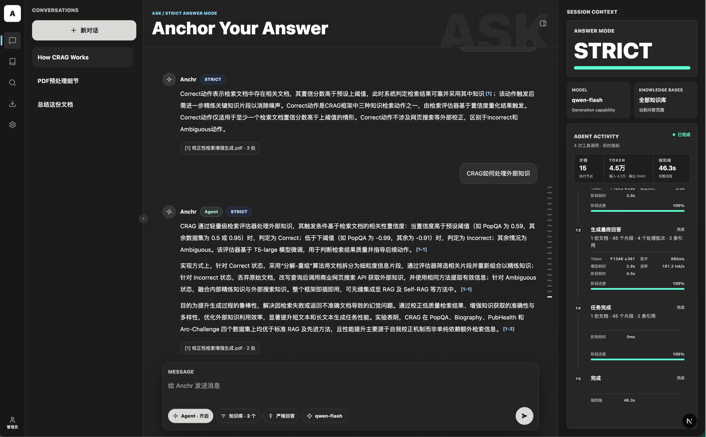
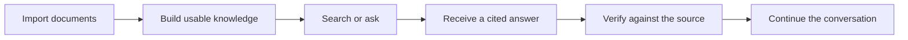
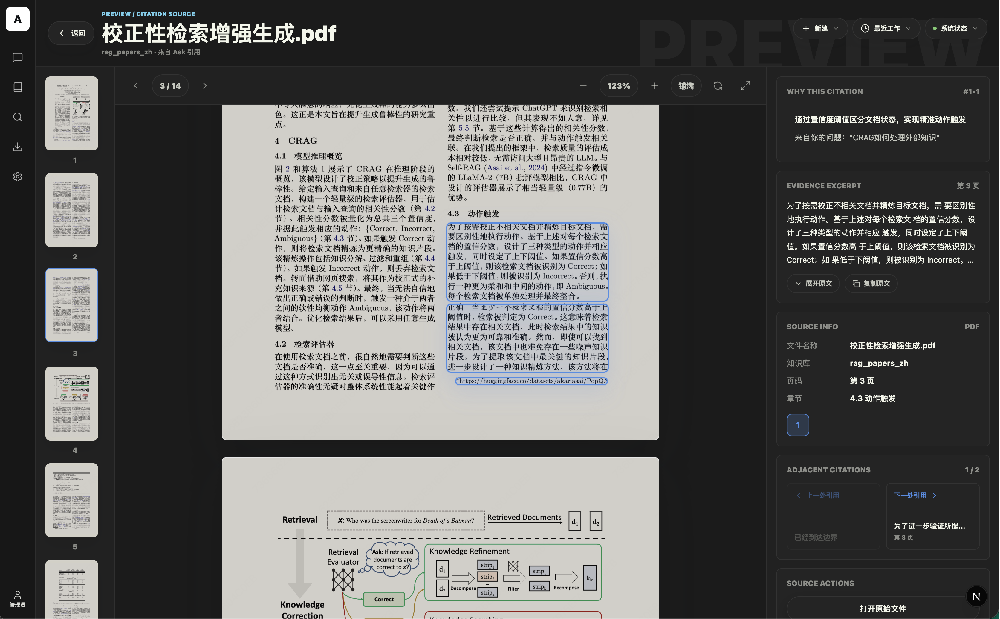
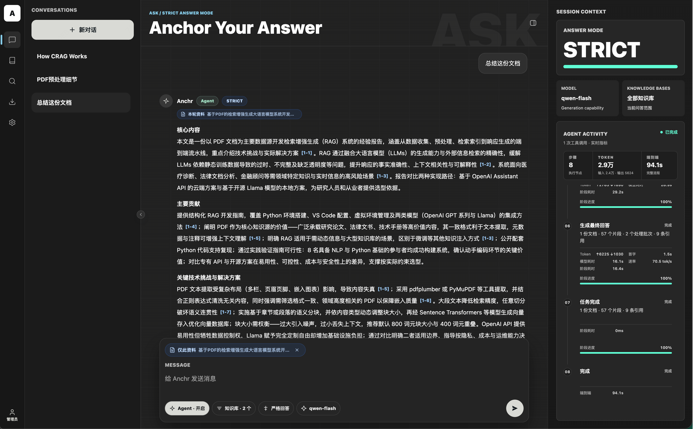

# Anchr

**An evidence-first workspace for knowledge grounded in your own documents.** 
From ingestion and hybrid search to Agent-assisted deep reading, Anchr keeps answers sourced, work bounded, and conclusions inspectable.

[中文产品介绍](../README.md) · Product overview · [中文技术文档](./technical.zh-CN.md) · [English technical guide](./technical.en.md)

  
   
  Anchr workspace · Click to view the full-size image

---

<b>Contents</b>

- [What is Anchr?](#what-is-anchr)
- [Why Anchr exists](#why-anchr-exists)
- [Quick start](#quick-start)
- [Product journey](#product-journey)
- [Core experience](#core-experience)
- [What Anchr offers](#what-anchr-offers)
- [How a trusted answer is formed](#how-a-trusted-answer-is-formed)
- [Use cases](#use-cases)
- [Who it is for](#who-it-is-for)
- [Deployment and tenancy model](#deployment-and-tenancy-model)
- [What makes Anchr different](#what-makes-anchr-different)
- [How to evaluate Anchr](#how-to-evaluate-anchr)
- [Product components](#product-components)
- [Current stage](#current-stage)
- [Documentation](#documentation)

## What is Anchr?

Anchr is an open-source, self-hostable document knowledge workspace for people who need to search, question, study, and reuse information from their own materials.

It turns source documents into searchable, citable, and previewable evidence. You can search directly, ask within a knowledge base or a selected set of documents, and continue into multi-step exploration when a question requires discovery, sequential reading, or synthesis across sources.

Anchr is designed around a practical standard for knowledge work: a useful answer should reveal what supports it, let the reader return to the source, and make longer-running work understandable.

> [!IMPORTANT]
> This repository contains the Anchr API service. The complete product experience uses [Anchr Web](https://github.com/ryanmeowy/anchr-web); document processing also requires [Anchr Docling](https://github.com/ryanmeowy/anchr-docling), configured storage, and model providers.

## Why Anchr exists

Many knowledge systems successfully store files but still leave the difficult part—using those files—up to the user.

| Common friction | Anchr's product response |
| --- | --- |
| Documents are available, but the right information remains hard to find | Organize content into bounded knowledge bases and discover it through both lexical and semantic relevance. |
| Search returns a list, while reading and synthesis remain manual | Continue from search results into evidence-grounded answers and multi-step document exploration. |
| AI answers sound confident, but their basis is unclear | Keep citations, document-level result cards, and source-context entry points with knowledge answers. |
| Cross-document questions require repeated searching and comparison | Let an Agent discover, search, read in sequence, and start document summaries within an authorized scope. |
| Ingestion, updates, and long tasks disappear into the background | Expose processing progress, failure state, and Agent activity, with recovery or cancellation where supported. |

The goal is not merely to shave seconds from a search. It is to shorten the full path from “the information is probably in these files” to “I can state and verify a conclusion.”

## Quick start

### Try the live workspace

Visit [anchr.cloud](https://anchr.cloud) to experience the browser workspace.

For a meaningful first evaluation, prepare a small set of documents you already know well:

1. Create a knowledge base and import the documents.
2. Wait until the content becomes available, then search for a fact you know is present.
3. Ask a question within a clearly selected knowledge scope.
4. Inspect the citations, result cards, and source preview.
5. Try a second question that requires searching, reading, or synthesizing across documents.

Familiar material makes three qualities immediately visible: **whether Anchr found the right content, whether the citations support the answer, and whether verification is easy.**

### Self-host Anchr

To run the complete product in your own environment:

1. Follow the [English technical guide](./technical.en.md) to start Anchr App and prepare Anchr Web and Anchr Docling.
2. Configure storage, generation, embedding, and reranking capabilities.
3. Start the Web workspace and follow the same evaluation path described above.

The current release uses a **single-instance, single-tenant** deployment model: one Anchr App deployment serves one organization or team and runs one App process or container replica. Deploy a separate environment for every organization that requires isolation. See [Deployment and tenancy model](#deployment-and-tenancy-model) and the [technical guide](./technical.en.md#single-instance-single-tenant-constraints).

## Product journey

Anchr treats this as one continuous experience. Ingestion quality affects retrieval; retrieval shapes the answer; citations and previews determine whether the answer can be trusted; history and recent activity make the work reusable.

## Core experience

### 📚 Build knowledge that stays usable

Organize documents by topic or business scope, import them in batches, and see processing progress, availability, and failure information. When content changes, reprocess it instead of treating the knowledge base as a one-time dataset.

### 🔎 Search beyond keywords

Find content through lexical and semantic relevance, then narrow the search to selected knowledge bases, documents, or content types. Browse the results directly or continue into an answer grounded in the retrieved evidence.

### 🎯 Ask within an explicit scope

Choose where an answer is allowed to come from. A question can use a broader knowledge base or focus on specific documents, making the boundary visible instead of leaving it as a hidden retrieval decision.

### 🌱 Inspect the evidence behind an answer

Knowledge answers include citations and document-level result cards. Open a cited segment with its surrounding context to see what the model used and decide whether the conclusion holds.

  
   
  Citations and source verification · Click to view the full-size image

### 🧭 Let the Agent work through real documents

For questions that require several steps, the Agent can discover documents, search knowledge, read in sequence, and initiate document summaries within the authorized scope. Runs have explicit limits and expose activity, recovery, and cancellation behavior.

  
   
  Agent document activity · Click to view the full-size image

### 🕘 Continue instead of starting over

Conversations, previous answers, recent questions, searches, citations, and document activity can be revisited. Knowledge exploration becomes a continuing workflow rather than a disposable prompt.

## What Anchr offers

| Capability | What it enables |
| --- | --- |
| **Knowledge bases and documents** | Create bounded knowledge spaces, import documents in batches, inspect health and processing state, retry failures, and update content. |
| **Hybrid retrieval** | Find content through lexical and semantic relevance, with knowledge-base, document, metadata, and modality constraints. |
| **Grounded answers** | Generate answers from retrieved evidence with citations, result cards, and suggested follow-up questions. |
| **Source verification** | Open cited segments with neighboring context and restore the evidence behind a conclusion. |
| **Agentic RAG** | Discover, search, read, and summarize documents while exposing Run activity and terminal state. |
| **Continuous workflow** | Preserve conversations and revisit recent questions, searches, citations, and imported documents. |
| **Runtime choice** | Run in your own environment and select generation, embedding, reranking, and storage providers. |
| **API integration** | Add document retrieval, grounded answers, and long-running knowledge tasks to an existing product or internal tool. |

## How a trusted answer is formed

Anchr treats trust as a chain the user can inspect, not as an abstract model score.

| Stage | User control or feedback |
| --- | --- |
| **Scope** | Select which knowledge bases or documents are allowed to support the question. |
| **Discovery** | Retrieve relevant passages and filter them against currently valid document content. |
| **Use** | Register the material that actually participates in the answer as evidence for this turn. |
| **Presentation** | Show citations and document-level result cards with a knowledge answer. |
| **Verification** | Open the cited segment and neighboring context to judge whether the answer is supported. |
| **Process** | Retain activity and terminal state for complex Agent work so the path to the result can be understood. |

> [!NOTE]
> A citation does not make an answer automatically correct. Its value is that an otherwise opaque generation becomes something a person can question, compare, and correct. Important conclusions should still be confirmed against the source and the real decision context.

## Use cases

### 📑 Policy and procedure lookup

Find the applicable clause in internal guidance, generate a cited explanation, and return to the source to verify conditions and surrounding context.

### 🧪 Research synthesis

Trace a topic across several reports, compare perspectives, synthesize findings, and preserve the source behind each important conclusion.

### 🗂️ Project knowledge review

Recover decisions, constraints, and background from proposals, meeting material, and delivery documents without relying solely on institutional memory.

### 💬 Product and support knowledge

Find feature explanations, operational steps, and known handling guidance, then provide repeatable answers that remain open to review.

### 📖 Long-document understanding

Ask within a selected document, read relevant sections in sequence, or initiate a separate document-summary task.

### 🔌 Knowledge capability integration

Add document search, evidence-grounded Q&A, and Agent document work to an existing portal, workspace, or internal application.

## Who it is for

- **Knowledge workers and researchers** who need to find information across substantial document collections and preserve sources for their conclusions.
- **Product, operations, and support teams** that repeatedly work from policies, manuals, proposals, and product documentation.
- **Teams managing internal knowledge** that care about content readiness, answer traceability, and efficient source verification.
- **Teams that prefer self-hosting** and want control over their documents, provider configuration, and storage choices.
- **Developers building knowledge products** who need a complete backend workflow behind their own interface or business process.

> [!NOTE]
> Anchr is not primarily designed for open-ended chat without source constraints. It is most useful when an answer should stay within a document scope and remain open to verification.

## Deployment and tenancy model

Anchr currently follows a **single-instance, single-tenant** design:

- One deployment belongs to one logical tenant: an organization or team that shares knowledge, configuration, and operations.
- One deployment runs one Anchr App process or container replica. Multiple people may use it, but horizontal replicas behind a load balancer are not supported.
- Knowledge bases organize content and narrow retrieval; they are not tenant security boundaries. `ADMIN`, `USER`, and `GUEST` are roles inside the same tenant, not tenant identities.
- Model, embedding, reranking, object-storage, and runtime settings apply to the whole deployment.

“Single tenant” does not mean “single user.” It means the current product does not isolate multiple organizations inside one deployment. Multi-tenant SaaS, tenant-specific administration and quotas, and horizontal App scaling are outside the current product boundary. Use separate deployments, data stores, storage namespaces, and secrets for mutually isolated tenants.

## What makes Anchr different

### Evidence is a product path, not a footnote

Answers, citations, result cards, and source previews are connected. Verification remains available after the answer appears.

### Search, Q&A, and reading belong together

Users can move from discovery into understanding, follow-up questions, and source reading without rebuilding the task in separate tools.

### Knowledge scope is first-class

The selected knowledge base or document set is part of the interaction. Complex work cannot silently expand beyond the authorized scope.

### Long-running work has boundaries and state

Agent and document tasks are not invisible background jobs. Their activity can be inspected, and supported work can be recovered or cancelled.

### Document change is part of the main workflow

Ingestion progress, failure handling, reparsing, and knowledge updates are product capabilities rather than operational afterthoughts.

### Deployment and provider choice remain yours

Anchr can run in your environment and use model and storage services that fit your requirements.

## How to evaluate Anchr

Do not judge a document knowledge product only by how natural its answers sound. Use familiar, realistic material and inspect the full workflow.

| Dimension | Questions to ask |
| --- | --- |
| **Knowledge readiness** | When does a document become usable? Are failures understandable? Can updated content be processed again? |
| **Retrieval quality** | Can Anchr find information you know exists? Do the scope and returned results match your expectation? |
| **Answer grounding** | Is the answer actually supported by the material? Do citations correspond to the key claims? |
| **Verification cost** | Can you reach the correct source passage quickly and see enough surrounding context? |
| **Complex-task behavior** | Does a cross-document question lead to orderly search and reading? Are activity, failure, and completion visible? |
| **Continuity** | Do conversation history and recent activity help you continue earlier work? |

A useful first test set contains three types of questions: one answered directly by a single document, one requiring synthesis across documents, and one for which the documents contain no answer. Together, they reveal much more than a polished happy-path response.

## Product components

| Component | Product responsibility |
| --- | --- |
| [**Anchr Web**](https://github.com/ryanmeowy/anchr-web) | The browser workspace for knowledge bases, search, Ask, preview, activity, and settings. |
| **Anchr App** | This repository; the product workflows for knowledge management, retrieval, answers, Agent work, activity, and configuration. |
| [**Anchr Docling**](https://github.com/ryanmeowy/anchr-docling) | Converts source documents into content that can be retrieved and read by the rest of the product. |

## Current stage

Anchr is under active development. Product surfaces, interfaces, and defaults may continue to evolve. The current focus is a dependable document-knowledge loop:

- continuously ingest and update content;
- keep search and questions inside an explicit knowledge scope;
- make answers inspectable through citations and source previews;
- give complex document work clear execution boundaries and visible state.

The live workspace is available at [anchr.cloud](https://anchr.cloud). Review the technical prerequisites before self-hosting.

## Documentation

- [中文产品介绍](../README.md)
- [English technical guide](./technical.en.md)
- [中文技术文档](./technical.zh-CN.md)
- [Agent RAG implementation](./agent-rag-workflow.md)
- [Domain boundaries and interactions](./domain-boundaries-and-interactions.md)
- [Index Rebuild Implementation Notes](./segment-index-online-rebuild.md)
- [Docker deployment](../docker/README.md)

---

**Give every knowledge answer an anchor back to its source.**

