# Segment 索引在线重建实现说明

本文记录 `anchr-app` 当前 Segment 索引在线重建的执行路径、并发边界、
Embedding profile 切换、失败恢复和运行限制。

## 1. 目标与约束

在线重建用于在 Embedding 模型、向量维度或向量空间配置变化时，把当前
Segment 索引迁移到新的物理索引。

当前约束：

- 只支持单 JVM、单租户。
- 旧物理索引在重建期间继续承担读写，是迁移过程中的权威数据源。
- 新物理索引是未绑定 alias 的影子索引，对线上查询不可见。
- 普通写入不同步调用目标模型，也不直接双写影子索引；旧索引写入成功后只登记
  `assetId` 为 dirty。
- dirty 集合、mutation sequence 和回填位置只保存在内存中。
- 重建失败或切换前进程重启时整次重来，不从断点恢复。
- 读请求始终通过 read alias，重建期间不停读。
- 写请求只在建立捕获边界和最终切换的短独占窗口内等待。

核心不变量：

1. alias 切换前，旧索引是线上数据和增量追平的唯一权威来源。
2. 影子索引未对外服务，因此 Asset 同步的删除、重新生成和写入不要求对线上原子。
3. alias 切换时，dirty 集合必须为空，且 mutation sequence 必须与锁外校验时一致。
4. 写入新索引的向量 fingerprint 必须与新索引 metadata 中的 fingerprint 一致。
5. `replaceGeneration` 的旧 generation 删除和新 Segment 写入不能被 alias 切换拆开。

## 2. 组件与职责

| 组件 | 职责 |
| --- | --- |
| `SegmentIndexManagerImpl` | 创建任务、推进阶段、控制两个独占窗口、切换 alias/profile、处理失败和启动恢复 |
| `SegmentIndexWriteBarrier` | 使用公平 `ReentrantReadWriteLock` 协调普通索引写入和最终切换 |
| `SegmentRebuildMutationTracker` | 在内存中维护 mutation sequence 和 `assetId -> latestSequence` |
| `SegmentIndexMigrationRunner` | `search_after` 扫描、投影规划、批量 Embedding、影子索引写入、Asset 追平和数量校验 |
| `SegmentPhysicalIndexFactory` | 创建物理索引并读写 profile/rebuild metadata |
| `SegmentIndexAliasManager` | 校验 read/write alias 拓扑并原子切换两个 alias |
| `SegmentIndexTopologyInspector` | 读取 alias 指向索引的 mapping/profile metadata，识别中断的切换 |
| `RetrievalGenerationIndexServiceImpl` | 校验摄取 fingerprint，在需要时重新向量化，并原子替换 generation |
| `ConfigDrivenEmbeddingAdapter` | 打开固定 profile Session，把领域批量请求适配到供应商 Client |
| `SearchSegmentBulkWriter` | 写入 write alias，成功后登记涉及的 dirty Asset |
| `EsSegmentRepository` | 查询和删除 Segment；成功删除后登记 dirty Asset |

`SegmentIndexManagerImpl.indexOpLock` 在整个重建期间持有，但它只串行化索引创建、
重建等管理操作。普通摄取不获取这把锁。普通摄取使用的是
`SegmentIndexWriteBarrier` 的共享许可。

## 3. 总体阶段

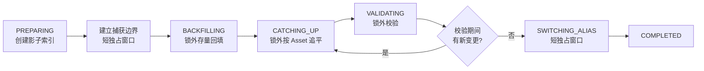

任一阶段抛出不可恢复异常时，进度进入 `FAILED`。旧索引继续服务，未绑定 alias 的
目标索引随后删除。

## 4. 配置选择与重建任务

Embedding 配置切换不会先修改 active 配置再重建。`CapabilityConfigServiceImpl`
比较当前 active profile 与目标 profile：

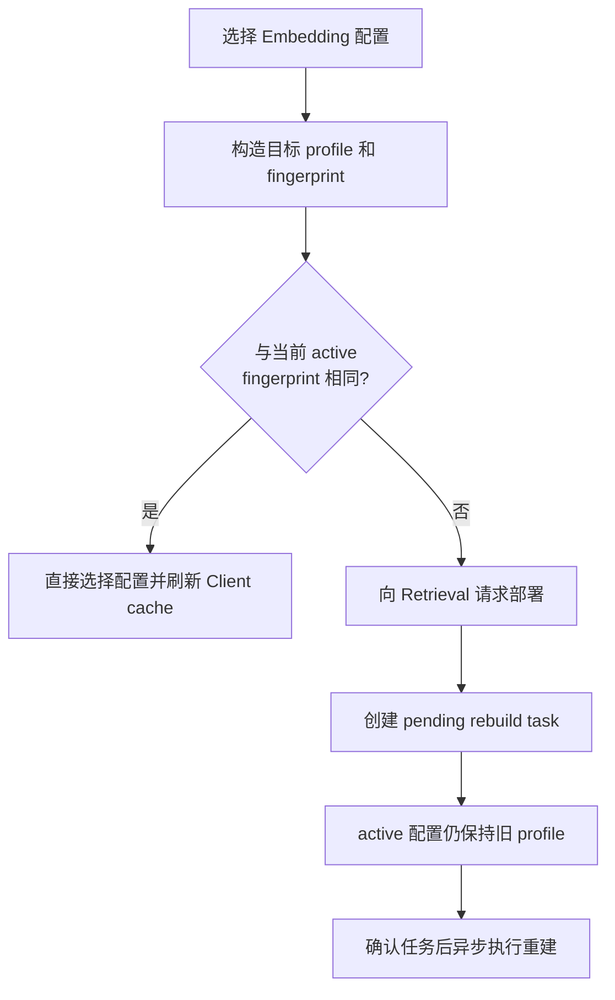

同一目标 fingerprint 的重复请求复用已有 task；不同目标会替换尚未执行的 pending
task。任务被确认后，状态从 `READY` 变为 `REBUILDING`，初始 phase 为
`PREPARING`。

当前 REST 入口保持不变：

| API | 作用 |
| --- | --- |
| `GET /api/v1/index/status` | 查询索引、profile、pending task 和重建进度 |
| `POST /api/v1/index/rebuild/prepare` | 根据当前 active profile 与索引 metadata 创建待确认任务 |
| `POST /api/v1/index/rebuild/confirm` | 确认指定 `taskId` 并异步开始重建 |

配置管理界面选择不同 fingerprint 的 Embedding 配置时，也会通过
`RetrievalEmbeddingDeploymentApi` 创建待重建任务，而不是直接激活目标配置。

## 5. 阶段一：创建影子索引

重建线程先打开目标 Embedding profile 的固定 Session，再读取并校验 alias 拓扑，
取得当前旧物理索引名称并创建影子索引。

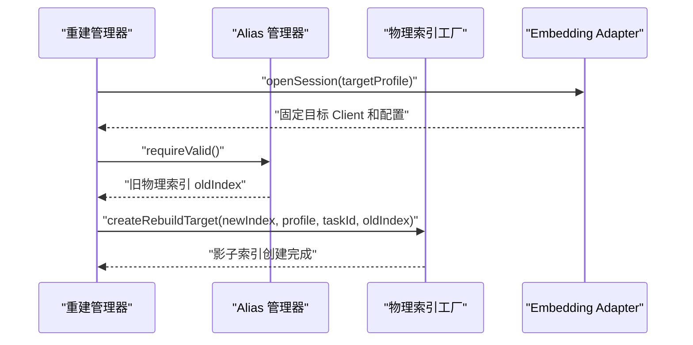

目标索引 mapping `_meta` 写入：

| Metadata | 含义 |
| --- | --- |
| `embeddingProfileVersion` | 当前固定为 `1` |
| `embeddingProfileFingerprint` | 目标向量空间标识 |
| `embeddingCapability` | `EMBEDDING` 或 `MULTI_EMBEDDING` |
| `embeddingModel` | 目标模型名 |
| `embeddingDimension` | 目标向量维度 |
| `embeddingConfigId` | Capability 配置 ID，存在时写入 |
| `rebuildTaskId` | 本次任务 ID |
| `rebuildState` | 初始为 `BUILDING` |
| `rebuildSourceIndex` | 旧物理索引名称 |

当前 fingerprint 使用 SHA-256，由以下字段按规范化结果生成：

- capability；
- 去除末尾 `/` 的 base URL；
- model name；
- `dimensions`。

API Key 不进入 fingerprint，也不写入索引 metadata。除 `dimensions` 外的其他
`extraConfig` 当前不参与 fingerprint。

## 6. 阶段二：建立增量捕获边界

创建目标索引后，重建线程第一次取得写屏障的独占许可。

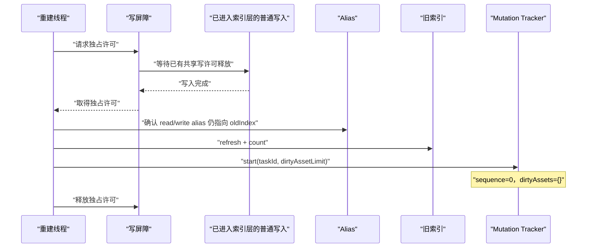

`SegmentRebuildMutationTracker.start` 创建新的内存跟踪状态。实现没有单独保存名为
`W0` 的字段；新 tracker 的 `sequence=0` 就是当前重建的有效捕获起点。

这个独占窗口内不执行：

- 旧索引扫描；
- Embedding；
- 影子索引批量写入；
- 全量校验。

## 7. 普通写入与 dirty 捕获

捕获开启后，普通索引操作仍只写 write alias，此时 alias 仍指向旧索引。成功后，
涉及的 Asset 被登记为 dirty。

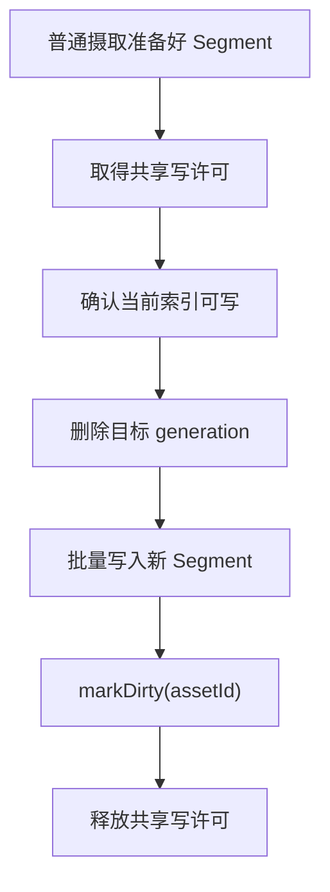

下列操作都经过共享写许可并参与捕获：

- `replaceGeneration`；
- `deleteByAssetId`；
- `deleteByAssetGeneration`；
- `SearchSegmentBulkWriter.write`。

`replaceGeneration` 在外层持有一次共享许可，使 generation 删除和批量写入不能被
最终 alias 切换分开。Repository 和 BulkWriter 内部再次获取共享许可是同一
`ReentrantReadWriteLock` 的可重入读锁，不会缩小外层临界区。

`markDirty` 的行为：

1. 全局 sequence 加一。
2. 把 `dirtyAssets[assetId]` 更新为最新 sequence。
3. 同一 Asset 的多次变化合并为一条最新版本记录。
4. dirty Asset 数超过 `rebuildDirtyAssetLimit` 时设置 overflow 标记。
5. overflow 不让当前正常写入失败；重建线程在追平阶段观察到标记后终止重建。

## 8. 阶段三：锁外存量回填

增量捕获开启后，重建线程释放独占许可，直接扫描旧物理索引并写影子索引。

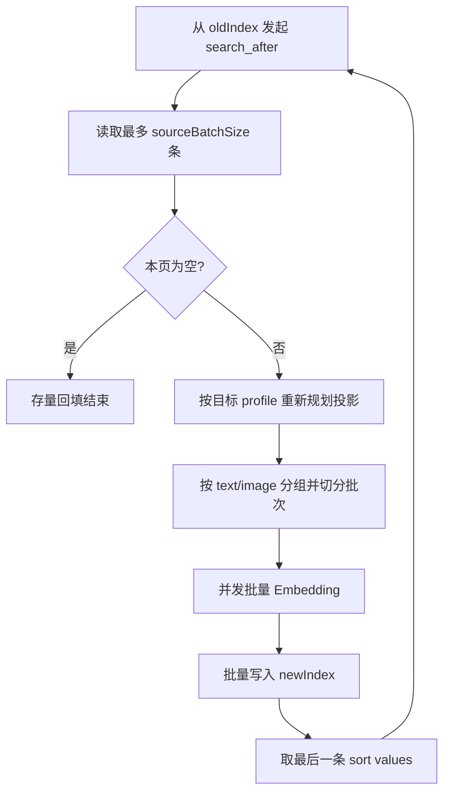

### 8.1 `search_after` 排序

每页默认读取 200 个源文档，排序字段依次为：

1. `assetId ASC`；
2. `indexGeneration ASC`，缺失值在前；
3. `segmentType DESC`，缺失值在后；
4. `segmentId ASC`。

`segmentId` 是最终稳定排序键。下一页使用上一页最后一条 Hit 的完整 sort values。
当前实现不再创建五分钟 scroll context，因此模型调用变慢不会导致 scroll 过期。

扫描期间旧索引可以变化：

- 扫描先看到旧状态，后续 dirty Asset 同步会覆盖为最终状态；
- 扫描晚于普通写入，可能直接看到新状态，dirty Asset 同步仍会再次覆盖；
- 扫描遇到已删除数据时不会写入它，删除操作本身也会登记 dirty Asset。

### 8.2 投影规划

`SegmentRebuildProjectionPlanner` 根据目标 capability 重新决定 Segment 形态：

- 文本文档保留 `TEXT_CHUNK`；
- 文本模型下，图片保留 `IMAGE_OCR_BLOCK`，不保留 `IMAGE_VISUAL`；
- 多模态模型下，图片保留 OCR 投影，并为每个 Asset generation 生成一个
  `IMAGE_VISUAL`；
- `DOCUMENT_IMAGE` 根据稳定 `sourceRef` 重新生成图片向量；
- 所有需要向量的目标投影先清空旧 embedding，再使用目标 Session 生成。

图片对象 key 会通过短期签名转换为模型输入；已经是稳定 HTTP/HTTPS 地址的输入
直接使用。

### 8.3 批量 Embedding

待向量化投影先按 `sourceType` 分组。`text` 按
`rebuildEmbeddingBatchSize` 切批；`image` 以及未知类型采用最保守策略，固定每批
一条。默认最多并发执行两个批次。

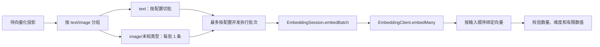

接口分层：

- `SearchEmbeddingPort.EmbeddingSession.embedBatch` 是 Search 领域批量接口；默认可
  逐条退化。
- `EmbeddingClient.embedMany` 是供应商 Client 的强制批量接口，没有默认实现。
- `TextEmbeddingClient` 把多个文本放入一次请求。
- `MultiEmbeddingClient` 支持 content 列表；重建调用方只会合并 text，image 每次
  只传一张。
- Adapter 遇到当前 Client 不支持的输入类型时可以明确逐条调用，但不会固定 sleep。

响应必须与输入数量一致。每条向量还要满足目标维度，并且不能包含 `null`、
`NaN` 或无穷值。

只有错误链包含 `429`、`Throttling`、`RateQuota` 或 `rate limit` 时才执行指数退避。
默认基准为 5 秒，等待序列约为 5、10、20、40 秒，并加入正负 20% 以内的随机抖动；
单批最多尝试 5 次。普通模型错误立即失败，不执行无意义等待。

## 9. 阶段四：按 Asset 增量追平

存量回填完成后进入 `CATCHING_UP`。每轮取得 dirty 集合的快照，快照值是 Asset
在该时刻的版本 `V`。

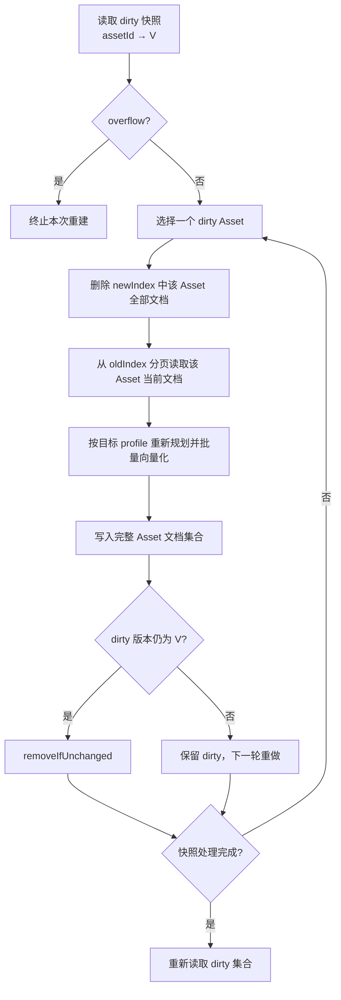

删除 Asset 时，旧索引返回空集合；目标索引中的该 Asset 被删除后不再写入，因此
删除不会被存量回填复活。

如果 Asset 同步期间发生新写入，`markDirty` 会把版本推进到大于 `V`。
`removeIfUnchanged(assetId, V)` 删除失败，该 Asset 会保留到下一轮。这避免旧同步结果
覆盖同步期间产生的新状态。

单个 Asset 同步中途失败只会让未对外服务的影子索引处于部分状态。当前实现不会在
影子索引内回滚该 Asset，而是终止整次重建并删除目标索引。

## 10. 阶段五：锁外校验

dirty 集合为空后进入 `VALIDATING`。

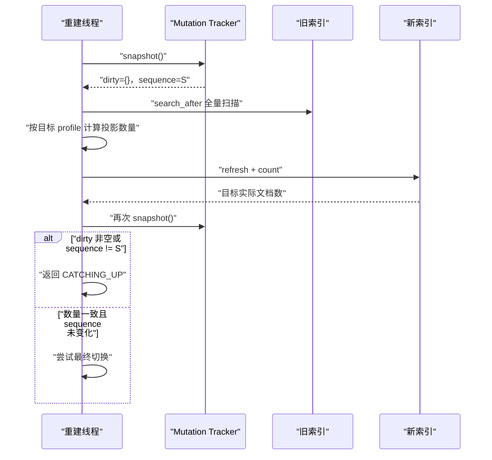

当前校验比较：

- 当前旧索引源文档数；
- 按目标 profile 重新规划后的预期投影数；
- 新索引实际文档数。

源文档数和目标投影数允许不同，例如切换到多模态 profile 后可能新增
`IMAGE_VISUAL`。校验期间不调用 Embedding，但会重新扫描旧索引并执行投影规划。

## 11. 阶段六：最终切换

锁外校验稳定后，重建线程第二次取得写屏障的独占许可。

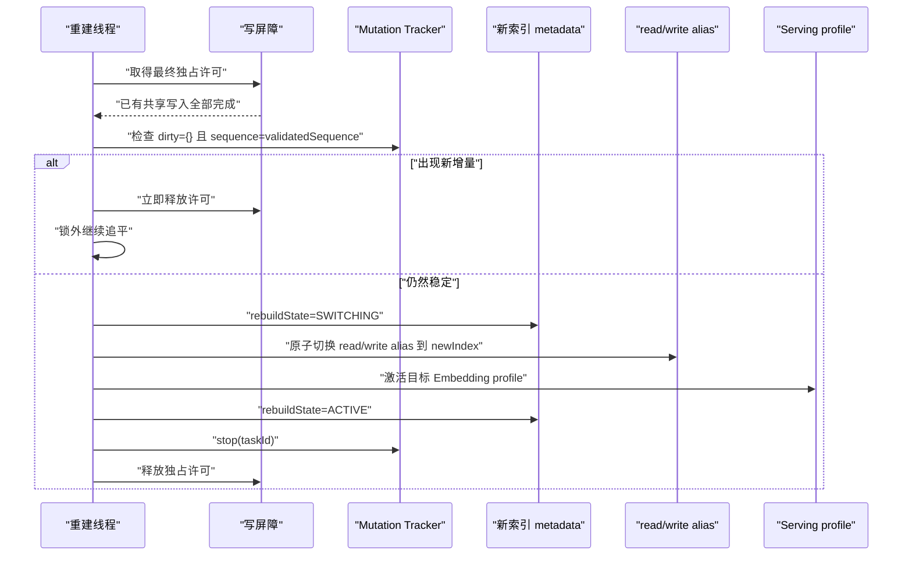

最终独占窗口只执行版本复查、metadata 更新、alias 切换和 profile 激活，不执行：

- Embedding；
- 旧索引扫描；
- 存量回填；
- Asset 追平；
- 全量数量校验。

alias 更新使用 Elasticsearch `_aliases` 原子请求，同时移动 read alias 和带
`is_write_index=true` 的 write alias。切换完成后再次读取 alias 拓扑确认目标索引。

如果 profile 激活失败，管理器在同一独占窗口内把 alias 从新索引切回旧索引，然后
让重建失败。旧索引因此继续承担读写。

## 12. 跨切换摄取与 profile fingerprint

摄取在 `EMBED` 阶段开始时调用一次 `IngestionEmbeddingPort.openSession()`。
`ConfigDrivenEmbeddingAdapter` 在 Session 中固定当时解析出的 Client、配置、
多模态能力和 fingerprint。同一文档的全部向量都使用该 Session。

系统级 active profile 只在最终切换时变化，但一份文档可能在切换前开始 Embedding，
在切换后才进入索引写入。

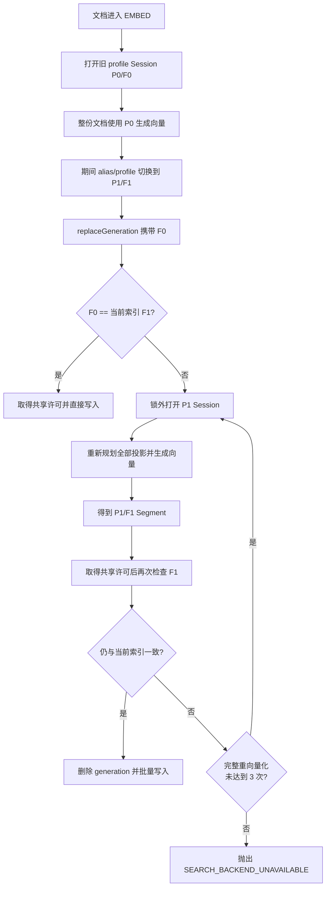

`RetrievalGenerationIndexRequest.embeddingProfileFingerprint` 描述请求中向量所属的
向量空间，不是 Asset generation。维度相同但模型、capability 或 base URL 不同，
fingerprint 仍会不同。

写入顺序：

1. 在锁外比较请求 fingerprint 和当前服务索引 fingerprint。
2. 不一致时，读取当前 active profile，并在锁外重新规划、重新向量化。
3. 取得共享写许可。
4. 在许可内再次读取当前服务索引 fingerprint。
5. 一致时，在同一共享许可内删除目标 generation 并批量写入。
6. 不一致时释放许可，使用最新 profile 在锁外重新生成后重试。
7. 完整重新投影和 Embedding 最多执行 3 次；达到上限后仍不稳定则抛出
   `SEARCH_BACKEND_UNAVAILABLE`，不删除 generation，也不写入索引。

正常 Ingestion 调用始终携带 fingerprint。请求模型保留了不带 fingerprint 的兼容
构造器；这类旧调用被视为已经匹配当前服务索引，不触发自动重新向量化。

## 13. 状态与进度

索引生命周期状态：

```text
NOT_READY -> INITIALIZING -> READY -> REBUILDING -> READY
                                           |
                                           +-> rebuildProgress.phase=FAILED
```

重建 phase：

| Phase | 含义 |
| --- | --- |
| `PREPARING` | 已认领任务，正在准备目标 Session 和影子索引 |
| `BACKFILLING` | 扫描旧索引并回填影子索引 |
| `CATCHING_UP` | 按 dirty Asset 重新同步 |
| `VALIDATING` | 锁外重新扫描并校验数量和 sequence |
| `SWITCHING_ALIAS` | 已进入最终独占窗口，准备切换 alias/profile |
| `COMPLETED` | 新索引已激活 |
| `FAILED` | 本次重建失败，旧索引继续服务 |

`REBUILDING` 不再表示停服：

- `readable=true`：查询继续读取旧 alias；
- `writable=true`：普通摄取继续写旧 alias；
- `rebuildProgress.dirtyAssets`：在 `CATCHING_UP` 阶段展示本轮观察到的 dirty 数量。

## 14. 失败与重启

### 14.1 运行时失败

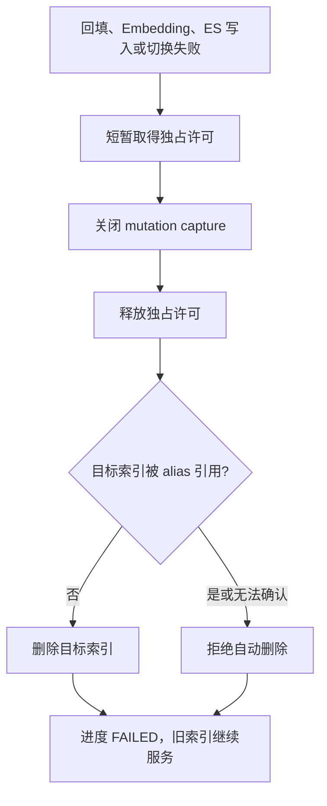

普通写入错误和重建错误隔离：dirty overflow 只使重建失败；旧索引写入成功后不会
因为影子索引、目标模型或 tracker overflow 而回滚。

当前回填和追平没有独立的 Elasticsearch 重试循环。Bulk、Delete 或 Search 超过
客户端自身能力后失败，会终止整次重建。Embedding 只对明确的限流错误重试。

### 14.2 进程重启

应用启动时先读取 read/write alias，并把两者指向的索引加入保护集合：

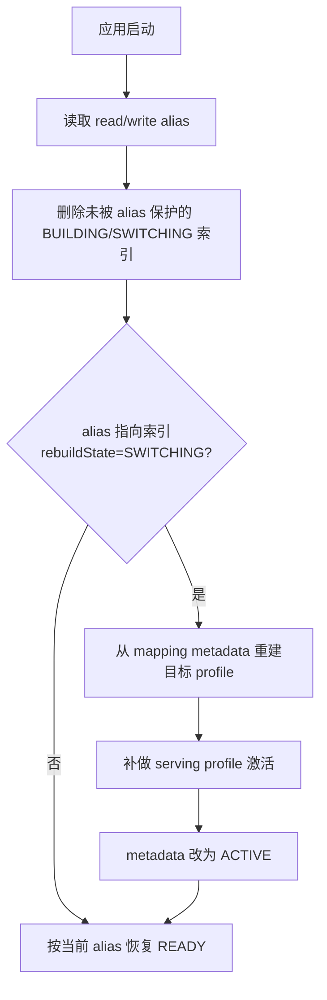

重启语义：

- alias 切换前重启：dirty 集合和进度丢失，未绑定 alias 的 BUILDING 目标被清理，
  后续重新发起完整重建。
- alias 已切换但 profile 尚未激活时重启：alias 指向索引仍为 SWITCHING，启动逻辑
  根据 metadata 补做 profile 激活。
- ACTIVE metadata 更新失败不影响已完成的 alias/profile 切换，启动检查仍以 alias
  指向的物理索引为准。

## 15. 旧索引与回滚

成功切换后不会立即删除旧物理索引。它只保留为切换时刻的静态快照，因为正常写入
已经停止向它登记和同步后续增量。

不能直接把 alias 切回旧索引作为安全回滚。需要回滚时，必须先把切换后的新增、
更新和删除同步回旧索引，或者以当前新索引为源重新构建另一个目标索引。

## 16. 运行配置

参数保存在通用 runtime-config 中，类型均为 `REBUILD`。可在前端
“设置 → 运行参数 → 索引重建”中修改。

| 配置 | 默认值 | 作用 |
| --- | ---: | --- |
| `rebuildSourceBatchSize` | 200 | `search_after` 每页源文档数 |
| `rebuildEmbeddingBatchSize` | 32 | 单个文本 Embedding 批次输入数，允许 1–2048；不影响图片单条策略 |
| `rebuildEmbeddingConcurrency` | 2 | 同一页内最大并发批次数，允许 1–16，需遵守账户并发配额 |
| `rebuildEmbeddingRateLimitMaxAttempts` | 5 | 限流批次最大尝试次数 |
| `rebuildEmbeddingRateLimitBackoffMs` | 5000 | 指数退避基准毫秒数 |
| `rebuildDirtyAssetLimit` | 100000 | dirty Asset 数上限 |

所有值必须大于零，非法值会使重建失败。修改配置影响后续读取配置的页或阶段；目标
Embedding Session 本身在整次重建开始时固定，不随运行配置或 active profile 变化。

## 17. 一致性边界

当前实现保证：

- 回填期间普通查询和摄取继续使用旧索引。
- 正常摄取不等待目标模型或影子索引写入。
- 新增、更新、generation 替换和 Asset 删除都会使 Asset 进入 dirty 集合。
- 同一 Asset 同步期间再次变化时，不会错误移出 dirty 集合。
- 锁外校验到最终加锁之间发生写入时，本次切换尝试取消并重新追平。
- 最终独占窗口不执行 Embedding 或全量扫描。
- 跨切换到达的旧 fingerprint 摄取会按当前 profile 重新生成向量。
- 同维度但 fingerprint 不同的向量不会直接写入新索引。
- 连续 profile 切换时，完整重向量化最多执行 3 次，不会无限循环。
- profile 激活失败时 alias 回到旧索引。

当前不提供：

- 多 JVM 之间的共享写屏障、分布式锁或持久化 dirty log；
- 重建断点续跑；
- 影子索引对线上读流量的灰度验证；
- 切换后旧索引的持续双写和直接回滚；
- Asset 同步在影子索引内部的事务性；
- 对普通 Elasticsearch 失败的应用层批次重试；
- 百万级吞吐、正常摄取 P95 和最终暂停时间的本地测试证明。

## 18. 测试与验收状态

当前自动化测试已覆盖：

- dirty Asset 合并到最新 sequence；
- Asset 同步期间版本变化时 `removeIfUnchanged` 不会误删；
- dirty 数超限只设置 tracker overflow；
- 文本投影按配置切批且调用次数符合 `ceil(投影数 / batchSize)`；
- 图片投影每批固定一张，不调用逐条 `embed`；
- Embedding 数量、维度和有限数值校验；
- 多模态图片只生成一个 `IMAGE_VISUAL`；
- 旧 fingerprint 请求按当前 profile 重新向量化；
- 连续 fingerprint 变化在 3 次重向量化后终止，且终止前不删除或写入 generation；
- generation 替换的输入校验和删除后写入顺序；
- `REBUILDING` 状态保持可写；
- 重建任务并发确认只认领一次；
- Spring 构造器装配。

仍需在真实 Elasticsearch 和模型环境验收：

1. 阻塞回填线程时，普通摄取能完成旧索引写入。
2. 回填期间并发新增、更新、替换 generation 和删除 Asset，切换后逐 Asset 对比。
3. 写入发生在扫描前后两种顺序下，都不复活删除数据或覆盖新数据。
4. dirty 空检查与最终独占许可之间注入写入，确认切换取消。
5. alias 已切换但 profile 未激活时强制重启，确认启动自愈。
6. alias/profile 切换异常时确认 alias 回滚。
7. 百万级回填吞吐、摄取 P95、dirty 积压和最终写暂停时长。

本地 Maven 测试通过只能证明单元和进程内协作逻辑，Testcontainers 被跳过时不能作为
真实 Elasticsearch 验收结论。

## 19. 代码索引

| 能力 | 文件 |
| --- | --- |
| 重建编排和状态 | `SegmentIndexManagerImpl.java`、`SegmentIndexLifecycleState.java` |
| 共享/独占写屏障 | `SegmentIndexWriteBarrier.java` |
| dirty Asset 跟踪 | `SegmentRebuildMutationTracker.java` |
| 扫描、批量向量化和追平 | `SegmentIndexMigrationRunner.java` |
| 目标投影规划 | `SegmentRebuildProjectionPlanner.java` |
| 物理索引 metadata | `SegmentPhysicalIndexFactory.java` |
| alias 管理 | `SegmentIndexAliasManager.java` |
| 启动拓扑检查和切换恢复 | `SegmentIndexTopologyInspector.java` |
| 摄取固定 Session | `IngestionEmbeddingStage.java`、`IngestionEmbeddingPort.java` |
| profile fingerprint | `CapabilityEmbeddingProfileFactory.java`、`EmbeddingProfile.java` |
| 跨切换 generation 写入 | `RetrievalGenerationIndexServiceImpl.java`、`RetrievalGenerationIndexRequest.java` |
| 批量 Embedding Adapter | `ConfigDrivenEmbeddingAdapter.java`、`EmbeddingClient.java` |
| 普通写入 dirty 捕获 | `SearchSegmentBulkWriter.java`、`EsSegmentRepository.java` |
| REST 状态和入口 | `IndexController.java`、`SegmentIndexStatusDTO.java` |
| 重建运行配置 | `SearchRebuildRuntimeSettings.java`、`SearchRuntimeConfigKey.java` |
