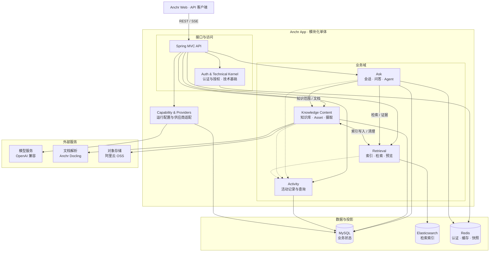

<div align="center">

# Anchr App

**面向文档智能、混合检索与 Agentic RAG 的证据优先后端。**

[](https://openjdk.org/)
[](https://spring.io/projects/spring-boot)
[](https://www.elastic.co/elasticsearch)
[](https://www.mysql.com/)
[](../LICENSE)

[Product homepage](../README.md) · [中文产品介绍](./product.zh-CN.md) · [English technical guide](./technical.en.md) · 中文技术文档

</div>

---

## 关于 Anchr

Anchr App 是 Anchr 知识系统的后端。它把文档转化为可检索、可引用的证据，并提供知识库管理、文档入库、相关片段召回、可信答案流式生成以及 Agent 执行过程追踪所需的完整工作流。

应用基于 Java 21 和 Spring Boot，以模块化单体方式组织。MySQL 保存业务事实，Elasticsearch 保存带版本的 Segment 检索投影，Redis 支撑访问令牌、ID 分段、查询改写缓存和可恢复的 Agent 快照；经过鉴权的 [Anchr Docling](https://github.com/ryanmeowy/anchr-docling) sidecar 负责文档解析。

> [!IMPORTANT]
> 本仓库只包含 API 服务。浏览器工作台请使用 [Anchr Web](https://github.com/ryanmeowy/anchr-web)。完整的文档入库流程还需要 Anchr Docling、对象存储和已配置的模型服务。

> [!NOTE]
> 项目仍在积极开发中。在稳定版本发布前，接口、数据库迁移和运维默认值可能继续演进。

## 核心能力

| 领域 | 能力 |
| --- | --- |
| **知识内容** | 知识库与文档生命周期、健康度与统计、对象存储引用、去重、Asset generation 版本管理和可靠清理。 |
| **文档入库** | 异步批量任务、客户端请求幂等、解析/向量化/索引阶段追踪、失败后人工整文档重试、重新解析、重新向量化和 Docling 集成。 |
| **混合检索** | 全文与向量双路召回、中文 IK 分词、RRF 融合、受控 Rerank、元数据/模态过滤和 generation 可见性校验。 |
| **证据优先回答** | 查询改写、答案生成、来源引用、结果卡片、追问建议、Segment 预览和原文上下文恢复。 |
| **Agentic RAG** | 带预算的工具执行、知识搜索、文档定位与顺序阅读、异步总结、Trace 持久化、运行恢复、取消和传统 RAG 降级。 |
| **流式工作流** | 通过 SSE 输出答案和长耗时 Agent 任务，并持久化终态以支持客户端刷新恢复。 |
| **运行时配置** | 加密保存 Generation、Embedding、多模态 Embedding、Rerank 与阿里云 OSS 配置，支持连通性测试和受控激活。 |
| **访问与运维** | Redis 支撑的 `ADMIN`、`USER`、`GUEST` 令牌、索引生命周期、Actuator 健康与指标、Recent 活动视图、Flyway 迁移和事务 Outbox。 |

## 设计原则

- **单实例单租户**：一个部署只运行一个 Anchr App 进程并服务一个逻辑租户；租户隔离通过独立部署实现，而不是在应用数据模型内动态分区。
- **证据先于表达**：知识型答案必须关联已注册的 Segment 和可恢复的原文预览。
- **状态所有权清晰**：MySQL 保存业务事实，Elasticsearch 是可以重建的检索投影。
- **文档入库可追踪**：入库任务保存状态和阶段进度；失败 Item 可以人工按整文档重试，但进程重启不会续跑中断的处理阶段。
- **Agent 任务可恢复**：Agent 任务另行持久化运行状态，并支持基于 Lease 的恢复和取消。
- **索引演进安全**：Asset generation 与物理索引版本分开管理，并通过 alias 完成激活。
- **隔离外部提供方**：通过窄 Port 隔离 OpenAI 兼容模型、Docling 和对象存储。
- **控制系统复杂度**：在一个可部署的模块化单体内维护领域边界，不做过早的微服务拆分。

## 单实例单租户架构约束

### 边界定义

当前受支持的部署单元是“一套环境、一个 Anchr App 实例、一个逻辑租户”。其中：

- **单实例**指同一环境同一时刻只运行一个 Anchr App JVM/容器副本。MySQL、Elasticsearch、Redis、Docling、对象存储和模型服务仍是外部依赖，不受“单 App 实例”数量定义限制。
- **单租户**指一套部署只承载一个组织或团队的业务数据与配置。租户边界等同于部署边界，应用请求中没有可用于切换租户的 `tenantId`。
- 同一租户可以签发多个访问令牌并使用 `ADMIN`、`USER`、`GUEST` 角色；角色只控制接口权限，不构成租户隔离。
- Knowledge Base 和会话中的知识范围只用于内容组织、检索收敛与业务授权，不构成不同组织之间的安全边界。

### 数据与配置归属

应用默认把以下资源视为当前唯一租户的共享资源：

| 资源 | 当前归属与约束 |
| --- | --- |
| MySQL | 业务表没有 `tenant_id` 分区；知识库、Asset、摄取任务、会话、Agent、活动和配置记录都属于当前部署。 |
| Elasticsearch | Segment 使用部署级固定读写 alias 和物理索引生命周期，不按租户路由。 |
| Redis | Token、ID 号段、缓存和 Agent 快照使用部署级命名空间，不作为跨租户隔离层。 |
| 对象存储 | 运行时只激活一套存储配置；Bucket 或前缀应专用于当前部署。 |
| 模型与运行配置 | Generation、Embedding、Rerank 及 Search/Agent/Ingestion 参数全局生效，不支持逐租户覆盖。 |

因此，备份、恢复、迁移、清理和容量规划均以整套部署为基本单位。不要把 `user_id`、访问角色、知识库 ID、对象前缀或客户端传入的过滤条件当作租户隔离机制。

### 为什么当前只支持单实例

当前实现包含进程内协调状态：

- 摄取 Worker 按单实例运行；进程重启后会把中断的任务项标记为失败，由用户发起整文档重试。
- Segment 索引写入屏障、生命周期状态和待确认的索引重建任务保存在进程内；多副本无法共同提供完整的互斥和状态一致性。
- Answer Event Broker 只在单 JVM 内分发实时事件，没有使用 Redis Pub/Sub 等跨实例总线。

虽然部分 Agent 任务使用 Lease 并可从 MySQL/Redis 恢复，这不代表整个应用已支持多实例。当前不应在负载均衡器后启动多个 App 副本，也不应让新旧版本在滚动发布期间同时处理业务流量。

### 多租户与水平扩展的部署方式

需要多个隔离租户时，为每个租户分别部署，并为其配置独立的：

1. Anchr App 与 Anchr Web 入口；
2. MySQL 数据库或独立数据库实例；
3. Elasticsearch 集群，至少是不会与其他部署共享固定 alias 的独立逻辑资源；
4. Redis 实例或严格独立的逻辑资源与键命名空间；
5. 对象存储 Bucket/前缀、应用密钥、管理员密钥和供应商凭据。

模型服务和 Docling 可以由多个部署共同使用，但必须在外部服务侧自行落实鉴权、容量、数据处理和审计边界。应用本身不提供跨租户控制面、租户路由、配额、计费或租户级密钥管理。

如果未来支持单部署多租户或 App 水平扩展，需要先引入端到端 `tenant_id` 与授权校验、租户化索引/缓存/对象键、分布式锁和事件总线、持久化索引生命周期状态，以及相应的数据迁移和隔离测试；在这些能力完成前，单实例单租户是架构约束而非仅仅推荐配置。

## 技术栈

| 层次 | 技术 |
| --- | --- |
| 运行时 | Java 21 · Spring Boot 3.5 |
| API | Spring MVC · Jakarta Validation · REST · SSE |
| 持久化 | MySQL 8.4 · MyBatis · Flyway |
| 检索 | Elasticsearch 8.18 · BM25/IK · HNSW 稠密向量 · RRF · Rerank |
| 运行时状态 | Redis 7.4 |
| AI 集成 | Spring AI · OpenAI 兼容的 Generation、Embedding、多模态 Embedding 与 Rerank 接口 |
| 文档与存储 | Anchr Docling · 阿里云 OSS · STS |
| 测试 | JUnit 5 · Mockito · Spring Test · Testcontainers |

## 系统架构



实线表示同步依赖，虚线表示不影响主流程的活动记录。跨域调用通过 Application API 与调用方 ACL；跨存储一致性由状态迁移和 Outbox 保障。

完整边界决策见[领域边界与交互](./domain-boundaries-and-interactions.md)。

## 快速开始

### 前置要求

- [JDK 21](https://openjdk.org/)
- [Apache Maven](https://maven.apache.org/) `3.6.3+`
- [Docker Engine](https://docs.docker.com/engine/install/) 与 Docker Compose
- 与 Elasticsearch `8.18.8` 匹配的 IK 分词插件压缩包
- 如需运行完整流程，还需要：
  - 正在运行的 [Anchr Docling](https://github.com/ryanmeowy/anchr-docling)；
  - 一个阿里云 OSS Bucket 及其凭据；
  - OpenAI 兼容的 Generation、Embedding 或多模态 Embedding、Rerank 服务。

### 1. 克隆仓库

```bash
git clone https://github.com/ryanmeowy/anchr-app.git anchr-app
cd anchr-app
```

### 2. 准备 Elasticsearch IK 插件

从 [analysis-ik releases](https://github.com/infinilabs/analysis-ik/releases) 下载与 Elasticsearch `8.18.8` 兼容的压缩包，并放到基础设施 Dockerfile 旁：

```text
docker/infra/elasticsearch-analysis-ik-8.18.8.zip
```

该压缩包已被 Git 忽略。在文件就位前，基础设施镜像无法构建。

### 3. 启动基础设施

```bash
cp docker/infra/.env.example docker/infra/.env
# 替换全部 change-me。
docker compose --env-file docker/infra/.env \
  -f docker/infra/compose.yml up -d --build
```

Elasticsearch、Redis 和 MySQL 只发布到宿主机回环端口。基础设施初始化使用 `ES_PASSWORD`、`REDIS_PASSWORD`、`MYSQL_DATABASE`、`MYSQL_USER`、`MYSQL_PASSWORD` 和 `MYSQL_ROOT_PASSWORD`。

### 4. 配置 Anchr App

```bash
cp docker/app/.env.example docker/app/.env
```

让其中的数据存储凭据与基础设施环境一致，然后配置 Docling 并替换所有应用密钥。使用以下命令生成加密材料：

```bash
openssl rand -base64 32
openssl rand -base64 16
```

第一个值填写到 `APP_ENCRYPT_KEY`，第二个值填写到 `APP_ENCRYPT_IV`。Docling Token 必须与 sidecar 中的 `ANCHR_DOCLING_API_TOKEN` 保持一致。

模板按以下分组组织：

| 分组 | 环境变量 | 用途 |
| --- | --- | --- |
| Redis | `REDIS_HOST`、`REDIS_PORT`、`REDIS_PASSWORD` | Token、分布式 ID 分段、查询改写缓存和 Agent 快照。 |
| Elasticsearch | `ES_USERNAME`、`ES_PASSWORD`、`ES_HOST` | Segment 索引、alias、全文召回和向量召回。 |
| MySQL | `MYSQL_URL`、`MYSQL_USER`、`MYSQL_PASSWORD` | 应用状态。 |
| 安全 | `APP_ADMIN_SECRET`、`APP_ENCRYPT_KEY`、`APP_ENCRYPT_IV` | Token 管理和模型/存储凭据加密。 |
| Docling | `APP_DOCLING_BASE_URL`、`APP_DOCLING_API_TOKEN` | 带鉴权的异步文档解析。 |
| Server | `SERVER_HOST`、`SERVER_PORT`、`PROFILES_ACTIVE` | HTTP 监听地址、端口和启用的 Spring Profile。 |

> [!WARNING]
> 不要提交任一 Docker `.env` 文件。已有加密配置存在时，应保持加密 Key 和 IV 稳定；生产环境请使用 Secret Manager。

### 5. 启动 Anchr App

构建并启动 API 容器：

```bash
docker compose --env-file docker/app/.env \
  -f docker/app/compose.yml up -d --build
```

Anchr Docling 仍作为独立服务运行。使用示例端口时，API 地址为 [http://127.0.0.1:8081](http://127.0.0.1:8081)。

如果要直接在本机 JVM 开发，请把应用环境模板复制到仓库根目录，将 Docker 服务名改为 `127.0.0.1`，再导出环境并运行 Maven：

```bash
cp docker/app/.env.example .env
# 为宿主机访问设置 REDIS_HOST 和 ES_HOST，并修改 MYSQL_URL 中的主机名。
set -a
source .env
set +a
mvn spring-boot:run
```

Flyway 会在启动时自动创建或迁移数据库。

检查应用健康状态：

```bash
curl http://127.0.0.1:8081/actuator/health
```

### 6. 创建访问令牌

使用配置的 Admin Secret 签发一个有效期一小时的管理员 Token：

```bash
curl --get http://127.0.0.1:8081/api/v1/auth/refresh-token \
  --header "X-Admin-Secret: ${APP_ADMIN_SECRET}" \
  --data-urlencode "role=ADMIN"
```

调用受保护接口时，通过 `X-Access-Token` Header 传入返回值。系统支持 `ADMIN`、`USER` 和 `GUEST` 三种角色；写入和管理接口以各 Controller 声明的角色为准。

### 7. 完成运行时配置

通过 Anchr Web 的 **Settings** 页面，或 `/api/v1/settings` 接口：

1. 配置并测试阿里云 OSS；
2. 配置 Generation 与 Rerank 服务；
3. 配置文本 Embedding 或多模态 Embedding 服务；
4. 激活选中的配置，并等待 Segment 索引进入 Ready 状态。

请将 Anchr Web 配置为连接当前 API 的 `http://127.0.0.1:8081`。

## API 概览

所有业务响应使用统一 Result Envelope。受保护接口需要 `X-Access-Token`。

| 路径前缀 | 职责 |
| --- | --- |
| `/api/v1/auth` | Token 校验与管理、上传 STS 临时凭据。 |
| `/api/v1/settings` | 模型能力与对象存储配置。 |
| `/api/v1/kbs` | 知识库、文档、健康度、预览与统计。 |
| `/api/v1/kbs/{kbId}/ingestion-tasks` | 创建入库任务、查询进度与失败 Item 重试。 |
| `/api/v1/kbs/{kbId}/documents/{assetId}` | 文档重新解析与重新向量化。 |
| `/api/v1/search` | 带过滤条件的混合检索与可选生成式回答。 |
| `/api/v1/conversations` | 会话、历史消息、同步回答与 SSE 回答。 |
| `/api/v1/agent/runs` · `/api/v1/agent/tasks` | Agent Trace、快照、恢复、任务流式输出与取消。 |
| `/api/v1/activity` | 最近问题、引用、搜索和文档。 |
| `/api/v1/index` · `/api/v1/preview` | Segment 索引生命周期与原文上下文预览。 |
| `/actuator` · `/api/v1/health` | 应用运行状态和 Elasticsearch 健康度。 |

## 配置说明

Search、Conversation、Agent、Ingestion 和 Outbox 的调优参数通过 Settings
管理，并以运行时 KV 记录保存。修改从下一次业务操作开始生效；已经开始的
操作继续使用启动时读取的值。某个 KV 没有覆盖值时，由调用方使用代码内置
的默认值。

[`application.yaml`](../src/main/resources/application.yaml) 配置数据库、
Redis、安全密钥和 Docling 等启动配置。Elasticsearch 连接由应用的
Elasticsearch 配置直接读取 `ES_USERNAME`、`ES_PASSWORD` 和 `ES_HOST`。
模型地址、API Key、模型名、向量维度和存储凭据由 Settings 运行时管理。

## 开发

### 常用命令

| 命令 | 说明 |
| --- | --- |
| `mvn spring-boot:run` | 以开发模式启动 API。 |
| `mvn test` | 运行单元、契约和集成测试；依赖 Docker 的测试需要可用的 Docker Daemon。 |
| `mvn -DskipTests package` | 构建可执行 Spring Boot JAR。 |
| `java -jar target/anchr-app-0.0.1-SNAPSHOT.jar` | 导出环境变量后运行构建产物。 |
| `docker compose --env-file docker/infra/.env -f docker/infra/compose.yml logs -f elasticsearch` | 查看 Elasticsearch 启动与插件日志。 |

### 持续集成

Pull Request 会在 JDK 21 上运行 `App CI / Verify` 检查，使用与本地验证相同的命令：

```bash
mvn -B -ntp -DskipTests compile
mvn -B -ntp test
```

检查会汇总 Surefire 的 tests、failures、errors 和 skipped 数量。Docker
可用时执行依赖 Testcontainers 的测试，并单独报告这些测试是已执行还是已跳过。
Surefire XML 报告会作为 workflow artifact 保留七天。

### 项目结构

持续维护的仓库与 Package 地图见 [`project_layout.text`](../project_layout.text)。

### 延伸阅读

- [Agent RAG 完整工作流](./agent-rag-workflow.md)
- [领域边界与交互](./domain-boundaries-and-interactions.md)
- [Docker 部署](../docker/README.md)

## 生产部署提示

- 每套环境只启动一个 Anchr App 副本。升级时先停止旧实例，再启动新实例；不要采用会让新旧副本同时接收业务流量的滚动发布。
- 每套部署只服务一个租户。不同组织使用独立部署和独立数据/密钥边界，不要使用知识库、角色或请求过滤条件模拟租户隔离。
- 在可信反向代理终止 TLS，并为 SSE 路径关闭响应缓冲。
- 让 MySQL、Elasticsearch、Redis、Docling、模型服务和对象存储走私有网络。
- 在源码之外保存 Admin、加密、Docling、模型与存储密钥。
- 持久化并备份 MySQL 与对象存储；将 Elasticsearch 索引作为可重建投影管理。
- 监控 `/actuator/health`、`/actuator/metrics`、入库失败、Agent Task Lease、Outbox 重试和索引 alias 状态。
- 应用重启后需要检查被中断的入库 Item：它们会被标记为失败，必须人工按整文档重试。Agent 的恢复和取消是另一套基于 Lease 的能力。
- 上线前使用接近生产的数据验证数据库迁移与索引重建。

## 参与贡献

欢迎提交 Bug、想法和范围清晰的 Pull Request。

1. 先创建 Issue，描述行为或提案。
2. 从目标基线创建聚焦的分支。
3. 除非变更明确要求，否则保持领域状态所有权和现有 REST/SSE 契约。
4. 为行为、失败路径以及持久化/查询变化补充测试。
5. 运行相关测试和上述 CI 命令，并单独说明 Docker/Testcontainers 跳过项。

请勿在公开 Issue 中附带访问令牌、模型 Key、存储凭据、私有文档或生产 Trace。

## 开源许可

Anchr App 基于 [MIT License](../LICENSE) 开源。

---

<div align="center">

用心构建每一个可追溯的答案。

Copyright © 2026

</div>
